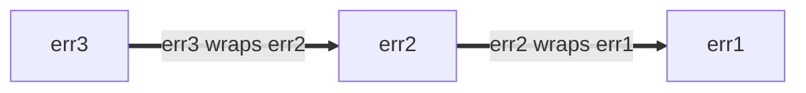

<!--* toc_depth: 3 *-->

# Go Style Best Practices

https://google.github.io/styleguide/go/best-practices

[Overview](index) | [Guide](guide) | [Decisions](decisions) |
[Best practices](best-practices)

<!--

-->



**Note:** This is part of a series of documents that outline [Go Style](index)
at Google. This document is **neither [normative](index#normative) nor
[canonical](index#canonical)**, and is an auxiliary document to the
[core style guide](guide). See [the overview](index#about) for more information.

<a id="about"></a>

## About

This file documents **guidance about how to best apply the Go Style Guide**.
This guidance is intended for common situations that arise frequently, but may
not apply in every circumstance. Where possible, multiple alternative approaches
are discussed along with the considerations that go into the decision about when
and when not to apply them.

See [the overview](index#about) for the full set of Style Guide documents.

<a id="naming"></a>

## Naming

<a id="function-names"></a>

### Function and method names

<a id="function-name-repetition"></a>

#### Avoid repetition

When choosing the name for a function or method, consider the context in which
the name will be read. Consider the following recommendations to avoid excess
[repetition](decisions#repetition) at the call site:

*   The following can generally be omitted from function and method names:

    *   The types of the inputs and outputs (when there is no collision)
    *   The type of a method's receiver
    *   Whether an input or output is a pointer

*   For functions, do not
    [repeat the name of the package](decisions#repetitive-with-package).

    ```go
    // Bad:
    package yamlconfig

    func ParseYAMLConfig(input string) (*Config, error)
    ```

    ```go
    // Good:
    package yamlconfig

    func Parse(input string) (*Config, error)
    ```

*   For methods, do not repeat the name of the method receiver.

    ```go
    // Bad:
    func (c *Config) WriteConfigTo(w io.Writer) (int64, error)
    ```

    ```go
    // Good:
    func (c *Config) WriteTo(w io.Writer) (int64, error)
    ```

*   Do not repeat the names of variables passed as parameters.

    ```go
    // Bad:
    func OverrideFirstWithSecond(dest, source *Config) error
    ```

    ```go
    // Good:
    func Override(dest, source *Config) error
    ```

*   Do not repeat the names and types of the return values.

    ```go
    // Bad:
    func TransformYAMLToJSON(input *Config) *jsonconfig.Config
    ```

    ```go
    // Good:
    func Transform(input *Config) *jsonconfig.Config
    ```

When it is necessary to disambiguate functions of a similar name, it is
acceptable to include extra information.

```go
// Good:
func (c *Config) WriteTextTo(w io.Writer) (int64, error)
func (c *Config) WriteBinaryTo(w io.Writer) (int64, error)
```

<a id="function-name-conventions"></a>

#### Naming conventions

There are some other common conventions when choosing names for functions and
methods:

*   Functions that return something are given noun-like names.

    ```go
    // Good:
    func (c *Config) JobName(key string) (value string, ok bool)
    ```

    A corollary of this is that function and method names should
    [avoid the prefix `Get`](decisions#getters).

    ```go
    // Bad:
    func (c *Config) GetJobName(key string) (value string, ok bool)
    ```

*   Functions that do something are given verb-like names.

    ```go
    // Good:
    func (c *Config) WriteDetail(w io.Writer) (int64, error)
    ```

*   Identical functions that differ only by the types involved include the name
    of the type at the end of the name.

    ```go
    // Good:
    func ParseInt(input string) (int, error)
    func ParseInt64(input string) (int64, error)
    func AppendInt(buf []byte, value int) []byte
    func AppendInt64(buf []byte, value int64) []byte
    ```

    If there is a clear "primary" version, the type can be omitted from the name
    for that version:

    ```go
    // Good:
    func (c *Config) Marshal() ([]byte, error)
    func (c *Config) MarshalText() (string, error)
    ```

<a id="naming-doubles"></a>

### Test double packages and types

There are several disciplines you can apply to [naming] packages and types that
provide test helpers and especially [test doubles]. A test double could be a
stub, fake, mock, or spy.

These examples mostly use stubs. Update your names accordingly if your code uses
fakes or another kind of test double.

[naming]: guide#naming
[test doubles]: https://en.wikipedia.org/wiki/Test_double

Suppose you have a well-focused package providing production code similar to
this:

```go
package creditcard

import (
    "errors"

    "path/to/money"
)

// ErrDeclined indicates that the issuer declines the charge.
var ErrDeclined = errors.New("creditcard: declined")

// Card contains information about a credit card, such as its issuer,
// expiration, and limit.
type Card struct {
    // omitted
}

// Service allows you to perform operations with credit cards against external
// payment processor vendors like charge, authorize, reimburse, and subscribe.
type Service struct {
    // omitted
}

func (s *Service) Charge(c *Card, amount money.Money) error { /* omitted */ }
```

<a id="naming-doubles-helper-package"></a>

#### Creating test helper packages

Suppose you want to create a package that contains test doubles for another.
We'll use `package creditcard` (from above) for this example:

One approach is to introduce a new Go package based on the production one for
testing. A safe choice is to append the word `test` to the original package name
("creditcard" + "test"):

```go
// Good:
package creditcardtest
```

Unless stated explicitly otherwise, all examples in the sections below are in
`package creditcardtest`.

<a id="naming-doubles-simple"></a>

#### Simple case

You want to add a set of test doubles for `Service`. Because `Card` is
effectively a dumb data type, similar to a Protocol Buffer message, it needs no
special treatment in tests, so no double is required. If you anticipate only
test doubles for one type (like `Service`), you can take a concise approach to
naming the doubles:

```go
// Good:
import (
    "path/to/creditcard"
    "path/to/money"
)

// Stub stubs creditcard.Service and provides no behavior of its own.
type Stub struct{}

func (Stub) Charge(*creditcard.Card, money.Money) error { return nil }
```

This is strictly preferable to a naming choice like `StubService` or the very
poor `StubCreditCardService`, because the base package name and its domain types
imply what `creditcardtest.Stub` is.

Finally, if the package is built with Bazel, make sure the new `go_library` rule
for the package is marked as `testonly`:

```build
# Good:
go_library(
    name = "creditcardtest",
    srcs = ["creditcardtest.go"],
    deps = [
        ":creditcard",
        ":money",
    ],
    testonly = True,
)
```

The approach above is conventional and will be reasonably well understood by
other engineers.

See also:

*   [Go Tip #42: Authoring a Stub for Testing](https://google.github.io/styleguide/go/index.html#gotip)

<a id="naming-doubles-multiple-behaviors"></a>

#### Multiple test double behaviors

When one kind of stub is not enough (for example, you also need one that always
fails), we recommend naming the stubs according to the behavior they emulate.
Here we rename `Stub` to `AlwaysCharges` and introduce a new stub called
`AlwaysDeclines`:

```go
// Good:
// AlwaysCharges stubs creditcard.Service and simulates success.
type AlwaysCharges struct{}

func (AlwaysCharges) Charge(*creditcard.Card, money.Money) error { return nil }

// AlwaysDeclines stubs creditcard.Service and simulates declined charges.
type AlwaysDeclines struct{}

func (AlwaysDeclines) Charge(*creditcard.Card, money.Money) error {
    return creditcard.ErrDeclined
}
```

<a id="naming-doubles-multiple-types"></a>

#### Multiple doubles for multiple types

But now suppose that `package creditcard` contains multiple types worth creating
doubles for, as seen below with `Service` and `StoredValue`:

```go
package creditcard

type Service struct {
    // omitted
}

type Card struct {
    // omitted
}

// StoredValue manages customer credit balances.  This applies when returned
// merchandise is credited to a customer's local account instead of processed
// by the credit issuer.  For this reason, it is implemented as a separate
// service.
type StoredValue struct {
    // omitted
}

func (s *StoredValue) Credit(c *Card, amount money.Money) error { /* omitted */ }
```

In this case, more explicit test double naming is sensible:

```go
// Good:
type StubService struct{}

func (StubService) Charge(*creditcard.Card, money.Money) error { return nil }

type StubStoredValue struct{}

func (StubStoredValue) Credit(*creditcard.Card, money.Money) error { return nil }
```

<a id="naming-doubles-local-variables"></a>

#### Local variables in tests

When variables in your tests refer to doubles, choose a name that most clearly
differentiates the double from other production types based on context. Consider
some production code you want to test:

```go
package payment

import (
    "path/to/creditcard"
    "path/to/money"
)

type CreditCard interface {
    Charge(*creditcard.Card, money.Money) error
}

type Processor struct {
    CC CreditCard
}

var ErrBadInstrument = errors.New("payment: instrument is invalid or expired")

func (p *Processor) Process(c *creditcard.Card, amount money.Money) error {
    if c.Expired() {
        return ErrBadInstrument
    }
    return p.CC.Charge(c, amount)
}
```

In the tests, a test double called a "spy" for `CreditCard` is juxtaposed
against production types, so prefixing the name may improve clarity.

```go
// Good:
package payment

import "path/to/creditcardtest"

func TestProcessor(t *testing.T) {
    var spyCC creditcardtest.Spy

    proc := &Processor{CC: spyCC}

    // declarations omitted: card and amount
    if err := proc.Process(card, amount); err != nil {
        t.Errorf("proc.Process(card, amount) = %v, want %v", got, want)
    }

    charges := []creditcardtest.Charge{
        {Card: card, Amount: amount},
    }

    if got, want := spyCC.Charges, charges; !cmp.Equal(got, want) {
        t.Errorf("spyCC.Charges = %v, want %v", got, want)
    }
}
```

This is clearer than when the name is not prefixed.

```go
// Bad:
package payment

import "path/to/creditcardtest"

func TestProcessor(t *testing.T) {
    var cc creditcardtest.Spy

    proc := &Processor{CC: cc}

    // declarations omitted: card and amount
    if err := proc.Process(card, amount); err != nil {
        t.Errorf("proc.Process(card, amount) = %v, want %v", got, want)
    }

    charges := []creditcardtest.Charge{
        {Card: card, Amount: amount},
    }

    if got, want := cc.Charges, charges; !cmp.Equal(got, want) {
        t.Errorf("cc.Charges = %v, want %v", got, want)
    }
}
```

<a id="shadowing"></a>

### Shadowing

**Note:** This explanation uses two informal terms, *stomping* and *shadowing*.
They are not official concepts in the Go language spec.

Like many programming languages, Go has mutable variables: assigning to a
variable changes its value.

```go
// Good:
func abs(i int) int {
    if i < 0 {
        i *= -1
    }
    return i
}
```

When using [short variable declarations] with the `:=` operator, in some cases a
new variable is not created. We can call this *stomping*. It's OK to do this
when the original value is no longer needed.

```go
// Good:
// innerHandler is a helper for some request handler, which itself issues
// requests to other backends.
func (s *Server) innerHandler(ctx context.Context, req *pb.MyRequest) *pb.MyResponse {
    // Unconditionally cap the deadline for this part of request handling.
    ctx, cancel := context.WithTimeout(ctx, 3*time.Second)
    defer cancel()
    ctxlog.Info("Capped deadline in inner request")

    // Code here no longer has access to the original context.
    // This is good style if when first writing this, you anticipate
    // that even as the code grows, no operation legitimately should
    // use the (possibly unbounded) original context that the caller provided.

    // ...
}
```

Be careful using short variable declarations in a new scope, though: that
introduces a new variable. We can call this *shadowing* the original variable.
Code after the end of the block refers to the original. Here is a buggy attempt
to shorten the deadline conditionally:

```go
// Bad:
func (s *Server) innerHandler(ctx context.Context, req *pb.MyRequest) *pb.MyResponse {
    // Attempt to conditionally cap the deadline.
    if *shortenDeadlines {
        ctx, cancel := context.WithTimeout(ctx, 3*time.Second)
        defer cancel()
        ctxlog.Info(ctx, "Capped deadline in inner request")
    }

    // BUG: "ctx" here again means the context that the caller provided.
    // The above buggy code compiled because both ctx and cancel
    // were used inside the if statement.

    // ...
}
```

A correct version of the code might be:

```go
// Good:
func (s *Server) innerHandler(ctx context.Context, req *pb.MyRequest) *pb.MyResponse {
    if *shortenDeadlines {
        var cancel func()
        // Note the use of simple assignment, = and not :=.
        ctx, cancel = context.WithTimeout(ctx, 3*time.Second)
        defer cancel()
        ctxlog.Info(ctx, "Capped deadline in inner request")
    }
    // ...
}
```

In the case we called stomping, because there's no new variable, the type being
assigned must match that of the original variable. With shadowing, an entirely
new entity is introduced so it can have a different type. Intentional shadowing
can be a useful practice, but you can always use a new name if it improves
[clarity](guide#clarity).

It is not a good idea to use variables with the same name as standard packages
other than very small scopes, because that renders free functions and values
from that package inaccessible. Conversely, when picking a name for your
package, avoid names that are likely to require
[import renaming](decisions#import-renaming) or cause shadowing of otherwise
good variable names at the client side.

```go
// Bad:
func LongFunction() {
    url := "https://example.com/"
    // Oops, now we can't use net/url in code below.
}
```

[short variable declarations]: https://go.dev/ref/spec#Short_variable_declarations

<a id="util-packages"></a>

### Util packages

Go packages have a name specified on the `package` declaration, separate from
the import path. The package name matters more for readability than the path.

Go package names should be
[related to what the package provides](decisions#package-names). Naming a
package just `util`, `helper`, `common` or similar is usually a poor choice (it
can be used as *part* of the name though). Uninformative names make the code
harder to read, and if used too broadly they are liable to cause needless
[import conflicts](decisions#import-renaming).

Instead, consider what the callsite will look like.

```go
// Good:
db := spannertest.NewDatabaseFromFile(...)

_, err := f.Seek(0, io.SeekStart)

b := elliptic.Marshal(curve, x, y)
```

You can tell roughly what each of these do even without knowing the imports list
(`cloud.google.com/go/spanner/spannertest`, `io`, and `crypto/elliptic`). With
less focused names, these might read:

```go
// Bad:
db := test.NewDatabaseFromFile(...)

_, err := f.Seek(0, common.SeekStart)

b := helper.Marshal(curve, x, y)
```

<a id="package-size"></a>

## Package size

If you're asking yourself how big your Go packages should be and whether to
place related types in the same package or split them into different ones, a
good place to start is the [Go blog post about package names][blog-pkg-names].
Despite the post title, it's not solely about naming. It contains some helpful
hints and cites several useful articles and talks.

Here are some other considerations and notes.

Users see [godoc] for the package in one page, and any methods exported by types
supplied by the package are grouped by their type. Godoc also group constructors
along with the types they return. If *client code* is likely to need two values
of different type to interact with each other, it may be convenient for the user
to have them in the same package.

Code within a package can access unexported identifiers in the package. If you
have a few related types whose *implementation* is tightly coupled, placing them
in the same package lets you achieve this coupling without polluting the public
API with these details.

All of that being said, putting your entire project in a single package would
likely make that package too large. When something is conceptually distinct,
giving it its own small package can make it easier to use. The short name of the
package as known to clients together with the exported type name work together
to make a meaningful identifier: e.g. `bytes.Buffer`, `ring.New`. The
[blog post][blog-pkg-names] has more examples.

Go style is flexible about file size, because maintainers can move code within a
package from one file to another without affecting callers. But as a general
guideline: it is usually not a good idea to have a single file with many
thousands of lines in it, or having many tiny files. There is no "one type, one
file" convention as in some other languages. As a rule of thumb, files should be
focused enough that a maintainer can tell which file contains something, and the
files should be small enough that it will be easy to find once there. The
standard library often splits large packages to several source files, grouping
related code by file. The source for [package `bytes`] is a good example.
Packages with long package documentation may choose to dedicate one file called
`doc.go` that has the [package documentation](decisions#package-comments), a
package declaration, and nothing else, but this is not required.

Within the Google codebase and in projects using Bazel, directory layout for Go
code is different than it is in open source Go projects: you can have multiple
`go_library` targets in a single directory. A good reason to give each package
its own directory is if you expect to open source your project in the future.

See also:

*   [Test double packages](#naming-doubles)

[blog-pkg-names]: https://go.dev/blog/package-names
[package `bytes`]: https://go.dev/src/bytes/
[godoc]: https://pkg.go.dev/

<a id="imports"></a>

## Imports

<a id="import-protos"></a>

### Protos and stubs

Proto library imports are treated differently than standard Go imports due to
their cross-language nature. The convention for renamed proto imports are based
on the rule that generated the package:

*   The `pb` suffix is generally used for `go_proto_library` rules.
*   The `grpc` suffix is generally used for `go_grpc_library` rules.

Generally, a short one- or two-letter prefix is used:

```go
// Good:
import (
    fspb "path/to/package/foo_service_go_proto"
    fsgrpc "path/to/package/foo_service_go_grpc"
)
```

If there is only a single proto used by a package or the package is tied closely
to that proto, the prefix can be omitted:

import ( pb "path/to/package/foo_service_go_proto" grpc
"path/to/package/foo_service_go_grpc" )

If the symbols in the proto are generic or are not very self-descriptive, or if
shortening the package name with an acronym is unclear, a short word can suffice
as the prefix:

```go
// Good:
import (
    mapspb "path/to/package/maps_go_proto"
)
```

In this case `mapspb.Address` might be clearer than `mpb.Address` if the code in
question is not already clearly related to maps.

<a id="import-order"></a>

### Import ordering

Imports are typically grouped into the following two (or more) blocks, in order:

1.  Standard library imports (e.g., `"fmt"`)
1.  imports (e.g., "/path/to/somelib")
1.  (optional) Protobuf imports (e.g., `fpb "path/to/foo_go_proto"`)
1.  (optional) Side-effect imports (e.g., `_ "path/to/package"`)

If a file does not have a group for one of the optional categories above, the
relevant imports are included in the project import group.

Any import grouping that is clear and easy to understand is generally fine. For
example, a team may choose to group gRPC imports separately from protobuf
imports.

> **Note:** For code maintaining only the two mandatory groups (one group for
> the standard library and one for all other imports), the `goimports` tool
> produces output consistent with this guidance.
>
> However, `goimports` has no knowledge of groups beyond the mandatory ones; the
> optional groups are prone to invalidation by the tool. When optional groups
> are used, attention on the part of both authors and reviewers is required to
> ensure that groupings remain compliant.
>
> Either approach is fine, but do not leave the imports section in an
> inconsistent, partially grouped state.

<a id="error-handling"></a>

## Error handling

In Go, [errors are values]; they are created by code and consumed by code.
Errors can be:

*   Converted into diagnostic information for display to humans
*   Used by the maintainer
*   Interpreted by an end user

Error messages also show up across a variety of different surfaces including log
messages, error dumps, and rendered UIs.

Code that processes (produces or consumes) errors should do so deliberately. It
can be tempting to ignore or blindly propagate an error return value. However,
it is always worth considering whether the current function in the call frame is
positioned to handle the error most effectively. This is a large topic and it is
hard to give categorical advice. Use your judgment, but keep the following
considerations in mind:

*   When creating an error value, decide whether to give it any
    [structure](#error-structure).
*   When handling an error, consider [adding information](#error-extra-info)
    that you have but that the caller and/or callee might not.
*   See also guidance on [error logging](#error-logging).

While it is usually not appropriate to ignore an error, a reasonable exception
to this is when orchestrating related operations, where often only the first
error is useful. Package [`errgroup`] provides a convenient abstraction for a
group of operations that can all fail or be canceled as a group.

[errors are values]: https://go.dev/blog/errors-are-values
[`errgroup`]: https://pkg.go.dev/golang.org/x/sync/errgroup

See also:

*   [Effective Go on errors](https://go.dev/doc/effective_go#errors)
*   [A post by the Go Blog on errors](https://go.dev/blog/go1.13-errors)
*   [Package `errors`](https://pkg.go.dev/errors)
*   [Package `upspin.io/errors`](https://commandcenter.blogspot.com/2017/12/error-handling-in-upspin.html)
*   [GoTip #89: When to Use Canonical Status Codes as Errors](https://google.github.io/styleguide/go/index.html#gotip)
*   [GoTip #48: Error Sentinel Values](https://google.github.io/styleguide/go/index.html#gotip)
*   [GoTip #13: Designing Errors for Checking](https://google.github.io/styleguide/go/index.html#gotip)

<a id="error-structure"></a>

### Error structure

If callers need to interrogate the error (e.g., distinguish different error
conditions), give the error value structure so that this can be done
programmatically rather than having the caller perform string matching. This
advice applies to production code as well as to tests that care about different
error conditions.

The simplest structured errors are unparameterized global values.

```go
type Animal string

var (
    // ErrDuplicate occurs if this animal has already been seen.
    ErrDuplicate = errors.New("duplicate")

    // ErrMarsupial occurs because we're allergic to marsupials outside Australia.
    // Sorry.
    ErrMarsupial = errors.New("marsupials are not supported")
)

func pet(animal Animal) error {
    switch {
    case seen[animal]:
        return ErrDuplicate
    case marsupial(animal):
        return ErrMarsupial
    }
    seen[animal] = true
    // ...
    return nil
}
```

The caller can simply compare the returned error value of the function with one
of the known error values:

```go
// Good:
func handlePet(...) {
    switch err := process(an); err {
    case ErrDuplicate:
        return fmt.Errorf("feed %q: %v", an, err)
    case ErrMarsupial:
        // Try to recover with a friend instead.
        alternate = an.BackupAnimal()
        return handlePet(..., alternate, ...)
    }
}
```

The above uses sentinel values, where the error must be equal (in the sense of
`==`) to the expected value. That is perfectly adequate in many cases. If
`process` returns wrapped errors (discussed below), you can use [`errors.Is`].

```go
// Good:
func handlePet(...) {
    switch err := process(an); {
    case errors.Is(err, ErrDuplicate):
        return fmt.Errorf("feed %q: %v", an, err)
    case errors.Is(err, ErrMarsupial):
        // ...
    }
}
```

Do not attempt to distinguish errors based on their string form. (See
[Go Tip #13: Designing Errors for Checking](https://google.github.io/styleguide/go/index.html#gotip)
for more.)

```go
// Bad:
func handlePet(...) {
    err := process(an)
    if regexp.MatchString(`duplicate`, err.Error()) {...}
    if regexp.MatchString(`marsupial`, err.Error()) {...}
}
```

If there is extra information in the error that the caller needs
programmatically, it should ideally be presented structurally. For example, the
[`os.PathError`] type is documented to place the pathname of the failing
operation in a struct field which the caller can easily access.

Other error structures can be used as appropriate, for example a project struct
containing an error code and detail string. [Package `status`][status] is a
common encapsulation; if you choose this approach (which you are not obligated
to do), use [canonical codes]. See
[Go Tip #89: When to Use Canonical Status Codes as Errors](https://google.github.io/styleguide/go/index.html#gotip)
to know if using status codes is the right choice.

[`os.PathError`]: https://pkg.go.dev/os#PathError
[`errors.Is`]: https://pkg.go.dev/errors#Is
[status]: https://pkg.go.dev/google.golang.org/grpc/status
[canonical codes]: https://pkg.go.dev/google.golang.org/grpc/codes

<a id="error-extra-info"></a>

### Adding information to errors

Any function returning an error should strive to make the error value useful.
Often, the function is in the middle of a callchain and is merely propagating an
error from some other function that it called (maybe even from another package).
Here there is an opportunity to annotate the error with extra information, but
the programmer should ensure there's sufficient information in the error without
adding duplicate or irrelevant detail. If you're unsure, try triggering the
error condition during development: that's a good way to assess what the
observers of the error (either humans or code) will end up with.

Convention and good documentation help. For example, the standard package `os`
advertises that its errors contain path information when it is available. This
is a useful style, because callers getting back an error don't need to annotate
it with information that they had already provided the failing function.

```go
// Good:
if err := os.Open("settings.txt"); err != nil {
    return err
}

// Output:
//
// open settings.txt: no such file or directory
```

If there is something interesting to say about the *meaning* of the error, of
course it can be added. Just consider which level of the callchain is best
positioned to understand this meaning.

```go
// Good:
if err := os.Open("settings.txt"); err != nil {
    // We convey the significance of this error to us. Note that the current
    // function might perform more than one file operation that can fail, so
    // these annotations can also serve to disambiguate to the caller what went
    // wrong.
    return fmt.Errorf("launch codes unavailable: %v", err)
}

// Output:
//
// launch codes unavailable: open settings.txt: no such file or directory
```

Contrast with the redundant information here:

```go
// Bad:
if err := os.Open("settings.txt"); err != nil {
    return fmt.Errorf("could not open settings.txt: %w", err)
}

// Output:
//
// could not open settings.txt: open settings.txt: no such file or directory
```

When adding information to a propagated error, you can either wrap the error or
present a fresh error. Wrapping the error with the `%w` verb in `fmt.Errorf`
allows callers to access data from the original error. This can be very useful
at times, but in other cases these details are misleading or uninteresting to
the caller. See the
[blog post on error wrapping](https://blog.golang.org/go1.13-errors) for more
information. Wrapping errors also expands the API surface of your package in a
non-obvious way, and this can cause breakages if you change the implementation
details of your package.

It is best to avoid using `%w` unless you also document (and have tests that
validate) the underlying errors that you expose. If you do not expect your
caller to call `errors.Unwrap`, `errors.Is` and so on, don't bother with `%w`.

The same concept applies to [structured errors](#error-structure) like
[`*status.Status`][status] (see [canonical codes]). For example, if your server
sends malformed requests to a backend and receives an `InvalidArgument` code,
this code should *not* be propagated to the client, assuming that the client has
done nothing wrong. Instead, return an `Internal` canonical code to the client.

However, annotating errors helps automated logging systems preserve the status
payload of an error. For example, annotating the error is appropriate in an
internal function:

```go
// Good:
func (s *Server) internalFunction(ctx context.Context) error {
    // ...
    if err != nil {
        return fmt.Errorf("couldn't find remote file: %w", err)
    }
}
```

Code directly at system boundaries (typically RPC, IPC, storage, and similar)
should report errors using the canonical error space. It is the responsibility
of code here to handle domain-specific errors and represent them canonically.
For example:

```go
// Bad:
func (*FortuneTeller) SuggestFortune(context.Context, *pb.SuggestionRequest) (*pb.SuggestionResponse, error) {
    // ...
    if err != nil {
        return nil, fmt.Errorf("couldn't find remote file: %w", err)
    }
}
```

```go
// Good:
import (
    "google.golang.org/grpc/codes"
    "google.golang.org/grpc/status"
)
func (*FortuneTeller) SuggestFortune(context.Context, *pb.SuggestionRequest) (*pb.SuggestionResponse, error) {
    // ...
    if err != nil {
        // Or use fmt.Errorf with the %w verb if deliberately wrapping an
        // error which the caller is meant to unwrap.
        return nil, status.Errorf(codes.Internal, "couldn't find fortune database", status.ErrInternal)
    }
}
```

<a id="error-percent-w"></a>

### Placement of %w in errors

Prefer to place `%w` at the end of an error string.

Errors can be wrapped with
[the `%w` verb](https://blog.golang.org/go1.13-errors), or by placing them in a
[structured error](https://google.github.io/styleguide/go/index.html#gotip) that
implements `Unwrap() error` (ex:
[`fs.PathError`](https://pkg.go.dev/io/fs#PathError)).

Wrapped errors form error chains: each new layer of wrapping adds a new entry to
the front of the error chain. The error chain can be traversed with the
`Unwrap() error` method. For example:

```go
err1 := fmt.Errorf("err1")
err2 := fmt.Errorf("err2: %w", err1)
err3 := fmt.Errorf("err3: %w", err2)
```

This forms an error chain of the form,



Regardless of where the `%w` verb is placed, the error returned always
represents the front of the error chain, and the `%w` is the next child.
Similarly, `Unwrap() error` always traverses the error chain from newest to
oldest error.

Placement of the `%w` verb does, however, affect whether the error chain is
printed newest to oldest, oldest to newest, or neither:

```go
// Good:
err1 := fmt.Errorf("err1")
err2 := fmt.Errorf("err2: %w", err1)
err3 := fmt.Errorf("err3: %w", err2)
fmt.Println(err3) // err3: err2: err1
// err3 is a newest-to-oldest error chain, that prints newest-to-oldest.
```

```go
// Bad:
err1 := fmt.Errorf("err1")
err2 := fmt.Errorf("%w: err2", err1)
err3 := fmt.Errorf("%w: err3", err2)
fmt.Println(err3) // err1: err2: err3
// err3 is a newest-to-oldest error chain, that prints oldest-to-newest.
```

```go
// Bad:
err1 := fmt.Errorf("err1")
err2 := fmt.Errorf("err2-1 %w err2-2", err1)
err3 := fmt.Errorf("err3-1 %w err3-2", err2)
fmt.Println(err3) // err3-1 err2-1 err1 err2-2 err3-2
// err3 is a newest-to-oldest error chain, that neither prints newest-to-oldest
// nor oldest-to-newest.
```

Therefore, in order for error text to mirror error chain structure, prefer
placing the `%w` verb at the end with the form `[...]: %w`.

<a id="error-logging"></a>

### Logging errors

Functions sometimes need to tell an external system about an error without
propagating it to their callers. Logging is an obvious choice here; but be
conscious of what and how you log errors.

*   Like [good test failure messages], log messages should clearly express what
    went wrong and help the maintainer by including relevant information to
    diagnose the problem.

*   Avoid duplication. If you return an error, it's usually better not to log it
    yourself but rather let the caller handle it. The caller can choose to log
    the error, or perhaps rate-limit logging using [`rate.Sometimes`]. Other
    options include attempting recovery or even [stopping the program]. In any
    case, giving the caller control helps avoid logspam.

    The downside to this approach, however, is that any logging is written using
    the caller's line coordinates.

*   Be careful with [PII]. Many log sinks are not appropriate destinations for
    sensitive end-user information.

*   Use `log.Error` sparingly. ERROR level logging causes a flush and is more
    expensive than lower logging levels. This can have serious performance
    impact on your code. When deciding between error and warning levels,
    consider the best practice that messages at the error level should be
    actionable rather than "more serious" than a warning.

*   Inside Google, we have monitoring systems that can be set up for more
    effective alerting than writing to a log file and hoping someone notices it.
    This is similar but not identical to the standard library
    [package `expvar`].

[good test failure messages]: https://google.github.io/styleguide/go/decisions#useful-test-failures
[stopping the program]: #checks-and-panics
[`rate.Sometimes`]: https://pkg.go.dev/golang.org/x/time/rate#Sometimes
[PII]: https://en.wikipedia.org/wiki/Personal_data
[package `expvar`]: https://pkg.go.dev/expvar

<a id="vlog"></a>

#### Custom verbosity levels

Use verbose logging ([`log.V`]) to your advantage. Verbose logging can be useful
for development and tracing. Establishing a convention around verbosity levels
can be helpful. For example:

*   Write a small amount of extra information at `V(1)`
*   Trace more information in `V(2)`
*   Dump large internal states in `V(3)`

To minimize the cost of verbose logging, you should ensure not to accidentally
call expensive functions even when `log.V` is turned off. `log.V` offers two
APIs. The more convenient one carries the risk of this accidental expense. When
in doubt, use the slightly more verbose style.

```go
// Good:
for _, sql := range queries {
  log.V(1).Infof("Handling %v", sql)
  if log.V(2) {
    log.Infof("Handling %v", sql.Explain())
  }
  sql.Run(...)
}
```

```go
// Bad:
// sql.Explain called even when this log is not printed.
log.V(2).Infof("Handling %v", sql.Explain())
```

[`log.V`]: https://pkg.go.dev/github.com/golang/glog#V

<a id="program-init"></a>

### Program initialization

Program initialization errors (such as bad flags and configuration) should be
propagated upward to `main`, which should call `log.Exit` with an error that
explains how to fix the error. In these cases, `log.Fatal` should not generally
be used, because a stack trace that points at the check is not likely to be as
useful as a human-generated, actionable message.

<a id="checks-and-panics"></a>

### Program checks and panics

As stated in the [decision against panics], standard error handling should be
structured around error return values. Libraries should prefer returning an
error to the caller rather than aborting the program, especially for transient
errors.

It is occasionally necessary to perform consistency checks on an invariant and
terminate the program if it is violated. In general, this is only done when a
failure of the invariant check means that the internal state has become
unrecoverable. The most reliable way to do this in the Google codebase is to
call `log.Fatal`. Using `panic` in these cases is not reliable, because it is
possible for deferred functions to deadlock or further corrupt internal or
external state.

Similarly, resist the temptation to recover panics to avoid crashes, as doing so
can result in propagating a corrupted state. The further you are from the panic,
the less you know about the state of the program, which could be holding locks
or other resources. The program can then develop other unexpected failure modes
that can make the problem even more difficult to diagnose. Instead of trying to
handle unexpected panics in code, use monitoring tools to surface unexpected
failures and fix related bugs with a high priority.

**Note:** The standard [`net/http` server] violates this advice and recovers
panics from request handlers. Consensus among experienced Go engineers is that
this was a historical mistake. If you sample server logs from application
servers in other languages, it is common to find large stacktraces that are left
unhandled. Avoid this pitfall in your servers.

[decision against panics]: https://google.github.io/styleguide/go/decisions#dont-panic
[`net/http` server]: https://pkg.go.dev/net/http#Server

<a id="when-to-panic"></a>

### When to panic

The standard library panics on API misuse. For example, [`reflect`] issues a
panic in many cases where a value is accessed in a way that suggests it was
misinterpreted. This is analogous to the panics on core language bugs such as
accessing an element of a slice that is out of bounds. Code review and tests
should discover such bugs, which are not expected to appear in production code.
These panics act as invariant checks that do not depend on a library, as the
standard library does not have access to the [levelled `log`] package that the
Google codebase uses.

[`reflect`]: https://pkg.go.dev/reflect
[levelled `log`]: decisions#logging

Another case in which panics can be useful, though uncommon, is as an internal
implementation detail of a package which always has a matching recover in the
callchain. Parsers and similar deeply nested, tightly coupled internal function
groups can benefit from this design, where plumbing error returns adds
complexity without value. The key attribute of this design is that these panics
are never allowed to escape across package boundaries and do not form part of
the package's API. This is typically accomplished with a top-level deferred
recover that translates a propagating panic into a returned error at the public
API surfaces.

Panic is also used when the compiler cannot identify unreachable code, for
example when using a function like `log.Fatal` that will not return:

```go
// Good:
func answer(i int) string {
    switch i {
    case 42:
        return "yup"
    case 54:
        return "base 13, huh"
    default:
        log.Fatalf("Sorry, %d is not the answer.", i)
        panic("unreachable")
    }
}
```

[Do not call `log` functions before flags have been parsed.](https://pkg.go.dev/github.com/golang/glog#pkg-overview)
If you must die in an `init` func, a panic is acceptable in place of the logging
call.

<a id="documentation"></a>

## Documentation

<a id="documentation-conventions"></a>

### Conventions

This section augments the decisions document's [commentary] section.

Go code that is documented in familiar style is easier to read and less likely
to be misused than something misdocumented or not documented at all. Runnable
[examples] show up in Godoc and Code Search and are an excellent way of
explaining how to use your code.

[examples]: decisions#examples

<a id="documentation-conventions-params"></a>

#### Parameters and configuration

Not every parameter must be enumerated in the documentation. This applies to:

*   function and method parameters
*   struct fields
*   APIs for options

Document the error-prone or non-obvious fields and parameters by saying why they
are interesting.

In the following snippet, the highlighted commentary adds little useful
information to the reader:

```go
// Bad:
// Sprintf formats according to a format specifier and returns the resulting
// string.
//
// format is the format, and data is the interpolation data.
func Sprintf(format string, data ...interface{}) string
```

However, this snippet demonstrates a code scenario similar to the previous where
the commentary instead states something non-obvious or materially helpful to the
reader:

```go
// Good:
// Sprintf formats according to a format specifier and returns the resulting
// string.
//
// The provided data is used to interpolate the format string. If the data does
// not match the expected format verbs or the amount of data does not satisfy
// the format specification, the function will inline warnings about formatting
// errors into the output string as described by the Format errors section
// above.
func Sprintf(format string, data ...interface{}) string
```

Consider your likely audience in choosing what to document and at what depth.
Maintainers, newcomers to the team, external users, and even yourself six months
in the future may appreciate slightly different information from what is on your
mind when you first come to write your docs.

See also:

*   [GoTip #41: Identify Function Call Parameters]
*   [GoTip #51: Patterns for Configuration]

[commentary]: decisions#commentary
[GoTip #41: Identify Function Call Parameters]: https://google.github.io/styleguide/go/index.html#gotip
[GoTip #51: Patterns for Configuration]: https://google.github.io/styleguide/go/index.html#gotip

<a id="documentation-conventions-contexts"></a>

#### Contexts

It is implied that the cancellation of a context argument interrupts the
function it is provided to. If the function can return an error, conventionally
it is `ctx.Err()`.

This fact does not need to be restated:

```go
// Bad:
// Run executes the worker's run loop.
//
// The method will process work until the context is cancelled and accordingly
// returns an error.
func (Worker) Run(ctx context.Context) error
```

Because that is implied, the following is better:

```go
// Good:
// Run executes the worker's run loop.
func (Worker) Run(ctx context.Context) error
```

Where context behavior is different or non-obvious, it should be expressly
documented:

*   If the function returns an error other than `ctx.Err()` when the context is
    cancelled:

    ```go
    // Good:
    // Run executes the worker's run loop.
    //
    // If the context is cancelled, Run returns a nil error.
    func (Worker) Run(ctx context.Context) error
    ```

*   If the function has other mechanisms that may interrupt it or affect
    lifetime:

    ```go
    // Good:
    // Run executes the worker's run loop.
    //
    // Run processes work until the context is cancelled or Stop is called.
    // Context cancellation is handled asynchronously internally: run may return
    // before all work has stopped. The Stop method is synchronous and waits
    // until all operations from the run loop finish. Use Stop for graceful
    // shutdown.
    func (Worker) Run(ctx context.Context) error

    func (Worker) Stop()
    ```

*   If the function has special expectations about context lifetime, lineage, or
    attached values:

    ```go
    // Good:
    // NewReceiver starts receiving messages sent to the specified queue.
    // The context should not have a deadline.
    func NewReceiver(ctx context.Context) *Receiver

    // Principal returns a human-readable name of the party who made the call.
    // The context must have a value attached to it from security.NewContext.
    func Principal(ctx context.Context) (name string, ok bool)
    ```

    **Warning:** Avoid designing APIs that make such demands (like contexts not
    having deadlines) from their callers. The above is only an example of how to
    document this if it cannot be avoided, not an endorsement of the pattern.

<a id="documentation-conventions-concurrency"></a>

#### Concurrency

Go users assume that conceptually read-only operations are safe for concurrent
use and do not require extra synchronization.

The extra remark about concurrency can safely be removed in this Godoc:

```go
// Len returns the number of bytes of the unread portion of the buffer;
// b.Len() == len(b.Bytes()).
//
// It is safe to be called concurrently by multiple goroutines.
func (*Buffer) Len() int
```

Mutating operations, however, are not assumed to be safe for concurrent use and
require the user to consider synchronization.

Similarly, the extra remark about concurrency can safely be removed here:

```go
// Grow grows the buffer's capacity.
//
// It is not safe to be called concurrently by multiple goroutines.
func (*Buffer) Grow(n int)
```

Documentation is strongly encouraged if:

*   it is unclear whether the operation is read-only or a mutating

    ```go
    // Good:
    package lrucache

    // Lookup returns the data associated with the key from the cache.
    //
    // This operation is not safe for concurrent use.
    func (*Cache) Lookup(key string) (data []byte, ok bool)
    ```

    Why? A cache hit when looking up the key mutate a LRU cache internally. How
    this is implemented may not be obvious to all readers.

*   synchronization is provided by API

    ```go
    // Good:
    package fortune_go_proto

    // NewFortuneTellerClient returns an *rpc.Client for the FortuneTeller service.
    // It is safe for simultaneous use by multiple goroutines.
    func NewFortuneTellerClient(cc *rpc.ClientConn) *FortuneTellerClient
    ```

    Why? Stubby provides synchronization.

    **Note:** If the API is a type and the API provides synchronization in
    entirety, conventionally only the type definition documents the semantics.

*   the API consumes user-implemented types of interfaces, and the interface's
    consumer has particular concurrency requirements:

    ```go
    // Good:
    package health

    // A Watcher reports the health of some entity (usually a backen service).
    //
    // Watcher methods are safe for simultaneous use by multiple goroutines.
    type Watcher interface {
        // Watch sends true on the passed-in channel when the Watcher's
        // status has changed.
        Watch(changed chan<- bool) (unwatch func())

        // Health returns nil if the entity being watched is healthy, or a
        // non-nil error explaining why the entity is not healthy.
        Health() error
    }
    ```

    Why? Whether an API is safe for use by multiple goroutines is part of its
    contract.

<a id="documentation-conventions-cleanup"></a>

#### Cleanup

Document any explicit cleanup requirements that the API has. Otherwise, callers
won't use the API correctly, leading to resource leaks and other possible bugs.

Call out cleanups that are up to the caller:

```go
// Good:
// NewTicker returns a new Ticker containing a channel that will send the
// current time on the channel after each tick.
//
// Call Stop to release the Ticker's associated resources when done.
func NewTicker(d Duration) *Ticker

func (*Ticker) Stop()
```

If it is potentially unclear how to clean up the resources, explain how:

```go
// Good:
// Get issues a GET to the specified URL.
//
// When err is nil, resp always contains a non-nil resp.Body.
// Caller should close resp.Body when done reading from it.
//
//    resp, err := http.Get("http://example.com/")
//    if err != nil {
//        // handle error
//    }
//    defer resp.Body.Close()
//    body, err := io.ReadAll(resp.Body)
func (c *Client) Get(url string) (resp *Response, err error)
```

<a id="documentation-preview"></a>

### Preview

Go features a
[documentation server](https://pkg.go.dev/golang.org/x/pkgsite/cmd/pkgsite). It
is recommended to preview the documentation your code produces both before and
during the code review process. This helps to validate that the
[godoc formatting] is rendered correctly.

[godoc formatting]: #godoc-formatting

<a id="godoc-formatting"></a>

### Godoc formatting

[Godoc] provides some specific syntax to [format documentation].

*   A blank line is required to separate paragraphs:

    ```go
    // Good:
    // LoadConfig reads a configuration out of the named file.
    //
    // See some/shortlink for config file format details.
    ```

*   Test files can contain [runnable examples] that appear attached to the
    corresponding documentation in godoc:

    ```go
    // Good:
    func ExampleConfig_WriteTo() {
      cfg := &Config{
        Name: "example",
      }
      if err := cfg.WriteTo(os.Stdout); err != nil {
        log.Exitf("Failed to write config: %s", err)
      }
      // Output:
      // {
      //   "name": "example"
      // }
    }
    ```

*   Indenting lines by an additional two spaces formats them verbatim:

    ```go
    // Good:
    // Update runs the function in an atomic transaction.
    //
    // This is typically used with an anonymous TransactionFunc:
    //
    //   if err := db.Update(func(state *State) { state.Foo = bar }); err != nil {
    //     //...
    //   }
    ```

    Note, however, that it can often be more appropriate to put code in a
    runnable example instead of including it in a comment.

    This verbatim formatting can be leveraged for formatting that is not native
    to godoc, such as lists and tables:

    ```go
    // Good:
    // LoadConfig reads a configuration out of the named file.
    //
    // LoadConfig treats the following keys in special ways:
    //   "import" will make this configuration inherit from the named file.
    //   "env" if present will be populated with the system environment.
    ```

*   A single line that begins with a capital letter, contains no punctuation
    except parentheses and commas, and is followed by another paragraph, is
    formatted as a header:

    ```go
    // Good:
    // The following line is formatted as a heading.
    //
    // Using headings
    //
    // Headings come with autogenerated anchor tags for easy linking.
    ```

[Godoc]: https://pkg.go.dev/
[format documentation]: https://go.dev/doc/comment
[runnable examples]: decisions#examples

<a id="signal-boost"></a>

### Signal boosting

Sometimes a line of code looks like something common, but actually isn't. One of
the best examples of this is an `err == nil` check (since `err != nil` is much
more common). The following two conditional checks are hard to distinguish:

```go
// Good:
if err := doSomething(); err != nil {
    // ...
}
```

```go
// Bad:
if err := doSomething(); err == nil {
    // ...
}
```

You can instead "boost" the signal of the conditional by adding a comment:

```go
// Good:
if err := doSomething(); err == nil { // if NO error
    // ...
}
```

The comment draws attention to the difference in the conditional.

<a id="vardecls"></a>

## Variable declarations

<a id="vardeclinitialization"></a>

### Initialization

For consistency, prefer `:=` over `var` when initializing a new variable with a
non-zero value.

```go
// Good:
i := 42
```

```go
// Bad:
var i = 42
```

<a id="vardeclzero"></a>

### Non-pointer zero values

The following declarations use the [zero value]:

```go
// Good:
var (
    coords Point
    magic  [4]byte
    primes []int
)
```

[zero value]: https://golang.org/ref/spec#The_zero_value

You should declare values using the zero value when you want to convey an empty
value that **is ready for later use**. Using composite literals with explicit
initialization can be clunky:

```go
// Bad:
var (
    coords = Point{X: 0, Y: 0}
    magic  = [4]byte{0, 0, 0, 0}
    primes = []int(nil)
)
```

A common application of zero value declaration is when using a variable as the
output when unmarshalling:

```go
// Good:
var coords Point
if err := json.Unmarshal(data, &coords); err != nil {
```

If you need a lock or other field that [must not be copied](decisions#copying)
in your struct, you can make it a value type to take advantage of zero value
initialization. It does mean that the containing type must now be passed via a
pointer and not a value. Methods on the type must take pointer receivers.

```go
// Good:
type Counter struct {
    // This field does not have to be "*sync.Mutex". However,
    // users must now pass *Counter objects between themselves, not Counter.
    mu   sync.Mutex
    data map[string]int64
}

// Note this must be a pointer receiver to prevent copying.
func (c *Counter) IncrementBy(name string, n int64)
```

It's acceptable to use value types for local variables of composites (such as
structs and arrays) even if they contain such uncopyable fields. However, if the
composite is returned by the function, or if all accesses to it end up needing
to take an address anyway, prefer declaring the variable as a pointer type at
the outset. Similarly, protobufs should be declared as pointer types.

```go
// Good:
func NewCounter(name string) *Counter {
    c := new(Counter) // "&Counter{}" is also fine.
    registerCounter(name, c)
    return c
}

var myMsg = new(pb.Bar) // or "&pb.Bar{}".
```

This is because `*pb.Something` satisfies [`proto.Message`] while `pb.Something`
does not.

```go
// Bad:
func NewCounter(name string) *Counter {
    var c Counter
    registerCounter(name, &c)
    return &c
}

var myMsg = pb.Bar{}
```

[`proto.Message`]: https://pkg.go.dev/google.golang.org/protobuf/proto#Message

> **Important:** Map types must be explicitly initialized before they can be
> modified. However, reading from zero-value maps is perfectly fine.
>
> For map and slice types, if the code is particularly performance sensitive and
> if you know the sizes in advance, see the [size hints](#vardeclsize) section.

<a id="vardeclcomposite"></a>

### Composite literals

The following are [composite literal] declarations:

```go
// Good:
var (
    coords   = Point{X: x, Y: y}
    magic    = [4]byte{'I', 'W', 'A', 'D'}
    primes   = []int{2, 3, 5, 7, 11}
    captains = map[string]string{"Kirk": "James Tiberius", "Picard": "Jean-Luc"}
)
```

You should declare a value using a composite literal when you know initial
elements or members.

In contrast, using composite literals to declare empty or memberless values can
be visually noisy compared to [zero-value initialization](#vardeclzero).

When you need a pointer to a zero value, you have two options: empty composite
literals and `new`. Both are fine, but the `new` keyword can serve to remind the
reader that if a non-zero value were needed, a composite literal wouldn't work:

```go
// Good:
var (
  buf = new(bytes.Buffer) // non-empty Buffers are initialized with constructors.
  msg = new(pb.Message) // non-empty proto messages are initialized with builders or by setting fields one by one.
)
```

[composite literal]: https://golang.org/ref/spec#Composite_literals

<a id="vardeclsize"></a>

### Size hints

The following are declarations that take advantage of size hints in order to
preallocate capacity:

```go
// Good:
var (
    // Preferred buffer size for target filesystem: st_blksize.
    buf = make([]byte, 131072)
    // Typically process up to 8-10 elements per run (16 is a safe assumption).
    q = make([]Node, 0, 16)
    // Each shard processes shardSize (typically 32000+) elements.
    seen = make(map[string]bool, shardSize)
)
```

Size hints and preallocation are important steps **when combined with empirical
analysis of the code and its integrations**, to create performance-sensitive and
resource-efficient code.

Most code does not need a size hint or preallocation, and can allow the runtime
to grow the slice or map as necessary. It is acceptable to preallocate when the
final size is known (e.g. when converting between a map and a slice) but this is
not a readability requirement, and may not be worth the clutter in small cases.

**Warning:** Preallocating more memory than you need can waste memory in the
fleet or even harm performance. When in doubt, see
[GoTip #3: Benchmarking Go Code] and default to a
[zero initialization](#vardeclzero) or a
[composite literal declaration](#vardeclcomposite).

[GoTip #3: Benchmarking Go Code]: https://google.github.io/styleguide/go/index.html#gotip

<a id="decl-chan"></a>

### Channel direction

Specify [channel direction] where possible.

```go
// Good:
// sum computes the sum of all of the values. It reads from the channel until
// the channel is closed.
func sum(values <-chan int) int {
    // ...
}
```

This prevents casual programming errors that are possible without specification:

```go
// Bad:
func sum(values chan int) (out int) {
    for v := range values {
        out += v
    }
    // values must already be closed for this code to be reachable, which means
    // a second close triggers a panic.
    close(values)
}
```

When the direction is specified, the compiler catches simple errors like this.
It also helps to convey a measure of ownership to the type.

See also Bryan Mills' talk "Rethinking Classical Concurrency Patterns":
[slides][rethinking-concurrency-slides] [video][rethinking-concurrency-video].

[rethinking-concurrency-slides]: https://drive.google.com/file/d/1nPdvhB0PutEJzdCq5ms6UI58dp50fcAN/view?usp=sharing
[rethinking-concurrency-video]: https://www.youtube.com/watch?v=5zXAHh5tJqQ
[channel direction]: https://go.dev/ref/spec#Channel_types

<a id="funcargs"></a>

## Function argument lists

Don't let the signature of a function get too long. As more parameters are added
to a function, the role of individual parameters becomes less clear, and
adjacent parameters of the same type become easier to confuse. Functions with
large numbers of arguments are less memorable and more difficult to read at the
call-site.

When designing an API, consider splitting a highly configurable function whose
signature is growing complex into several simpler ones. These can share an
(unexported) implementation if necessary.

Where a function requires many inputs, consider introducing an [option struct]
for some of the arguments or employing the more advanced [variadic options]
technique. The primary consideration for which strategy to choose should be how
the function call looks across all expected use cases.

The recommendations below primarily apply to exported APIs, which are held to a
higher standard than unexported ones. These techniques may be unnecessary for
your use case. Use your judgment, and balance the principles of [clarity] and
[least mechanism].

See also:
[Go Tip #24: Use Case-Specific Constructions](https://google.github.io/styleguide/go/index.html#gotip)

[option struct]: #option-structure
[variadic options]: #variadic-options
[clarity]: guide#clarity
[least mechanism]: guide#least-mechanism

<a id="option-structure"></a>

### Option structure

An option structure is a struct type that collects some or all of the arguments
of a function or method, that is then passed as the last argument to the
function or method. (The struct should be exported only if it is used in an
exported function.)

Using an option structure has a number of benefits:

*   The struct literal includes both fields and values for each argument, which
    makes them self-documenting and harder to swap.
*   Irrelevant or "default" fields can be omitted.
*   Callers can share the options struct and write helpers to operate on it.
*   Structs provide cleaner per-field documentation than function arguments.
*   Option structs can grow over time without impacting call-sites.

Here is an example of a function that could be improved:

```go
// Bad:
func EnableReplication(ctx context.Context, config *replicator.Config, primaryRegions, readonlyRegions []string, replicateExisting, overwritePolicies bool, replicationInterval time.Duration, copyWorkers int, healthWatcher health.Watcher) {
    // ...
}
```

The function above could be rewritten with an option structure as follows:

```go
// Good:
type ReplicationOptions struct {
    Config              *replicator.Config
    PrimaryRegions      []string
    ReadonlyRegions     []string
    ReplicateExisting   bool
    OverwritePolicies   bool
    ReplicationInterval time.Duration
    CopyWorkers         int
    HealthWatcher       health.Watcher
}

func EnableReplication(ctx context.Context, opts ReplicationOptions) {
    // ...
}
```

The function can then be called in a different package:

```go
// Good:
func foo(ctx context.Context) {
    // Complex call:
    storage.EnableReplication(ctx, storage.ReplicationOptions{
        Config:              config,
        PrimaryRegions:      []string{"us-east1", "us-central2", "us-west3"},
        ReadonlyRegions:     []string{"us-east5", "us-central6"},
        OverwritePolicies:   true,
        ReplicationInterval: 1 * time.Hour,
        CopyWorkers:         100,
        HealthWatcher:       watcher,
    })

    // Simple call:
    storage.EnableReplication(ctx, storage.ReplicationOptions{
        Config:         config,
        PrimaryRegions: []string{"us-east1", "us-central2", "us-west3"},
    })
}
```

**Note**: [Contexts are never included in option structs](decisions#contexts).

This option is often preferred when some of the following apply:

*   All callers need to specify one or more of the options.
*   A large number of callers need to provide many options.
*   The options are shared between multiple functions that the user will call.

<a id="variadic-options"></a>

### Variadic options

Using variadic options, exported functions are created which return closures
that can be passed to the [variadic (`...`) parameter] of a function. The
function takes as its parameters the values of the option (if any), and the
returned closure accepts a mutable reference (usually a pointer to a struct
type) that will be updated based on the inputs.

[variadic (`...`) parameter]: https://golang.org/ref/spec#Passing_arguments_to_..._parameters

Using variadic options can provide a number of benefits:

*   Options take no space at a call-site when no configuration is needed.
*   Options are still values, so callers can share them, write helpers, and
    accumulate them.
*   Options can accept multiple parameters (e.g. `cartesian.Translate(dx, dy
    int) TransformOption`).
*   The option functions can return a named type to group options together in
    godoc.
*   Packages can allow (or prevent) third-party packages to define (or from
    defining) their own options.

**Note:** Using variadic options requires a substantial amount of additional
code (see the following example), so it should only be used when the advantages
outweigh the overhead.

Here is an example of a function that could be improved:

```go
// Bad:
func EnableReplication(ctx context.Context, config *placer.Config, primaryCells, readonlyCells []string, replicateExisting, overwritePolicies bool, replicationInterval time.Duration, copyWorkers int, healthWatcher health.Watcher) {
  ...
}
```

The example above could be rewritten with variadic options as follows:

```go
// Good:
type replicationOptions struct {
    readonlyCells       []string
    replicateExisting   bool
    overwritePolicies   bool
    replicationInterval time.Duration
    copyWorkers         int
    healthWatcher       health.Watcher
}

// A ReplicationOption configures EnableReplication.
type ReplicationOption func(*replicationOptions)

// ReadonlyCells adds additional cells that should additionally
// contain read-only replicas of the data.
//
// Passing this option multiple times will add additional
// read-only cells.
//
// Default: none
func ReadonlyCells(cells ...string) ReplicationOption {
    return func(opts *replicationOptions) {
        opts.readonlyCells = append(opts.readonlyCells, cells...)
    }
}

// ReplicateExisting controls whether files that already exist in the
// primary cells will be replicated.  Otherwise, only newly-added
// files will be candidates for replication.
//
// Passing this option again will overwrite earlier values.
//
// Default: false
func ReplicateExisting(enabled bool) ReplicationOption {
    return func(opts *replicationOptions) {
        opts.replicateExisting = enabled
    }
}

// ... other options ...

// DefaultReplicationOptions control the default values before
// applying options passed to EnableReplication.
var DefaultReplicationOptions = []ReplicationOption{
    OverwritePolicies(true),
    ReplicationInterval(12 * time.Hour),
    CopyWorkers(10),
}

func EnableReplication(ctx context.Context, config *placer.Config, primaryCells []string, opts ...ReplicationOption) {
    var options replicationOptions
    for _, opt := range DefaultReplicationOptions {
        opt(&options)
    }
    for _, opt := range opts {
        opt(&options)
    }
}
```

The function can then be called in a different package:

```go
// Good:
func foo(ctx context.Context) {
    // Complex call:
    storage.EnableReplication(ctx, config, []string{"po", "is", "ea"},
        storage.ReadonlyCells("ix", "gg"),
        storage.OverwritePolicies(true),
        storage.ReplicationInterval(1*time.Hour),
        storage.CopyWorkers(100),
        storage.HealthWatcher(watcher),
    )

    // Simple call:
    storage.EnableReplication(ctx, config, []string{"po", "is", "ea"})
}
```

Prefer this option when many of the following apply:

*   Most callers will not need to specify any options.
*   Most options are used infrequently.
*   There are a large number of options.
*   Options require arguments.
*   Options could fail or be set incorrectly (in which case the option function
    returns an `error`).
*   Options require a lot of documentation that can be hard to fit in a struct.
*   Users or other packages can provide custom options.

Options in this style should accept parameters rather than using presence to
signal their value; the latter can make dynamic composition of arguments much
more difficult. For example, binary settings should accept a boolean (e.g.
`rpc.FailFast(enable bool)` is preferable to `rpc.EnableFailFast()`). An
enumerated option should accept an enumerated constant (e.g.
`log.Format(log.Capacitor)` is preferable to `log.CapacitorFormat()`). The
alternative makes it much more difficult for users who must programmatically
choose which options to pass; such users are forced to change the actual
composition of the parameters rather than simply changing the arguments to the
options. Don't assume that all users will know the full set of options
statically.

In general, options should be processed in order. If there is a conflict or if a
non-cumulative option is passed multiple times, the last argument should win.

The parameter to the option function is generally unexported in this pattern, to
restrict the options to being defined only within the package itself. This is a
good default, though there may be times when it is appropriate to allow other
packages to define options.

See [Rob Pike's original blog post] and [Dave Cheney's talk] for a more in-depth
look at how these options can be used.

[Rob Pike's original blog post]: http://commandcenter.blogspot.com/2014/01/self-referential-functions-and-design.html
[Dave Cheney's talk]: https://dave.cheney.net/2014/10/17/functional-options-for-friendly-apis

<a id="complex-clis"></a>

## Complex command-line interfaces

Some programs wish to present users with a rich command-line interface that
includes sub-commands. For example, `kubectl create`, `kubectl run`, and many
other sub-commands are all provided by the program `kubectl`. There are at least
the following libraries in common use for achieving this.

If you don't have a preference or other considerations are equal, [subcommands]
is recommended, since it is the simplest and is easy to use correctly. However,
if you need different features that it doesn't provide, pick one of the other
options.

*   **[cobra]**

    *   Flag convention: getopt
    *   Common outside the Google codebase.
    *   Many extra features.
    *   Pitfalls in usage (see below).

*   **[subcommands]**

    *   Flag convention: Go
    *   Simple and easy to use correctly.
    *   Recommended if you don't need extra features.

**Warning**: cobra command functions should use `cmd.Context()` to obtain a
context rather than creating their own root context with `context.Background`.
Code that uses the subcommands package already receives the correct context as a
function parameter.

You are not required to place each subcommand in a separate package, and it is
often not necessary to do so. Apply the same considerations about package
boundaries as in any Go codebase. If your code can be used both as a library and
as a binary, it is usually beneficial to separate the CLI code and the library,
making the CLI just one more of its clients. (This is not specific to CLIs that
have subcommands, but is mentioned here because it is a common place where it
comes up.)

[subcommands]: https://pkg.go.dev/github.com/google/subcommands
[cobra]: https://pkg.go.dev/github.com/spf13/cobra

<a id="tests"></a>

## Tests

<a id="test-functions"></a>

### Leave testing to the `Test` function

<!-- Note to maintainers: This section overlaps with decisions#assert and
decisions#mark-test-helpers. The point is not to repeat information, but
to have one place that summarizes the distinction that newcomers to the
language often wonder about. -->

Go distinguishes between "test helpers" and "assertion helpers":

*   **Test helpers** are functions that do setup or cleanup tasks. All failures
    that occur in test helpers are expected to be failures of the environment
    (not from the code under test) — for example when a test database cannot be
    started because there are no more free ports on this machine. For functions
    like these, calling `t.Helper` is often appropriate to
    [mark them as a test helper]. See [error handling in test helpers] for more
    details.

*   **Assertion helpers** are functions that check the correctness of a system
    and fail the test if an expectation is not met. Assertion helpers are
    [not considered idiomatic] in Go.

The purpose of a test is to report pass/fail conditions of the code under test.
The ideal place to fail a test is within the `Test` function itself, as that
ensures that [failure messages] and the test logic are clear.

[mark them as a test helper]: decisions#mark-test-helpers
[error handling in test helpers]: #test-helper-error-handling
[not considered idiomatic]: decisions#assert
[failure messages]: decisions#useful-test-failures

As your testing code grows, it may become necessary to factor out some
functionality to separate functions. Standard software engineering
considerations still apply, as *test code is still code*. If the functionality
does not interact with the testing framework, then all of the usual rules apply.
When the common code interacts with the framework, however, some care must be
taken to avoid common pitfalls that can lead to uninformative failure messages
and unmaintainable tests.

If many separate test cases require the same validation logic, arrange the test
in one of the following ways instead of using assertion helpers or complex
validation functions:

*   Inline the logic (both the validation and the failure) in the `Test`
    function, even if it is repetitive. This works best in simple cases.
*   If inputs are similar, consider unifying them into a [table-driven test]
    while keeping the logic inlined in the loop. This helps to avoid repetition
    while keeping the validation and failure in the `Test`.
*   If there are multiple callers who need the same validation function but
    table tests are not suitable (typically because the inputs are not simple
    enough or the validation is required as part of a sequence of operations),
    arrange the validation function so that it returns a value (typically an
    `error`) rather than taking a `testing.T` parameter and using it to fail the
    test. Use logic within the `Test` to decide whether to fail, and to provide
    [useful test failures]. You can also create test helpers to factor out
    common boilerplate setup code.

The design outlined in the last point maintains orthogonality. For example,
[package `cmp`] is not designed to fail tests, but rather to compare (and to
diff) values. It therefore does not need to know about the context in which the
comparison was made, since the caller can supply that. If your common testing
code provides a `cmp.Transformer` for your data type, that can often be the
simplest design. For other validations, consider returning an `error` value.

```go
// Good:
// polygonCmp returns a cmp.Option that equates s2 geometry objects up to
// some small floating-point error.
func polygonCmp() cmp.Option {
    return cmp.Options{
        cmp.Transformer("polygon", func(p *s2.Polygon) []*s2.Loop { return p.Loops() }),
        cmp.Transformer("loop", func(l *s2.Loop) []s2.Point { return l.Vertices() }),
        cmpopts.EquateApprox(0.00000001, 0),
        cmpopts.EquateEmpty(),
    }
}

func TestFenceposts(t *testing.T) {
    // This is a test for a fictional function, Fenceposts, which draws a fence
    // around some Place object. The details are not important, except that
    // the result is some object that has s2 geometry (github.com/golang/geo/s2)
    got := Fencepost(tomsDiner, 1*meter)
    if diff := cmp.Diff(want, got, polygonCmp()); diff != "" {
        t.Errorf("Fencepost(tomsDiner, 1m) returned unexpected diff (-want+got):\n%v", diff)
    }
}

func FuzzFencepost(f *testing.F) {
    // Fuzz test (https://go.dev/doc/fuzz) for the same.

    f.Add(tomsDiner, 1*meter)
    f.Add(school, 3*meter)

    f.Fuzz(func(t *testing.T, geo Place, padding Length) {
        got := Fencepost(geo, padding)
        // Simple reference implementation: not used in prod, but easy to
        // reasonable and therefore useful to check against in random tests.
        reference := slowFencepost(geo, padding)

        // In the fuzz test, inputs and outputs can be large so don't
        // bother with printing a diff. cmp.Equal is enough.
        if !cmp.Equal(got, reference, polygonCmp()) {
            t.Errorf("Fencepost returned wrong placement")
        }
    })
}
```

The `polygonCmp` function is agnostic about how it's called; it doesn't take a
concrete input type nor does it police what to do in case two objects don't
match. Therefore, more callers can make use of it.

**Note:** There is an analogy between test helpers and plain library code. Code
in libraries should usually [not panic] except in rare circumstances; code
called from a test should not stop the test unless there is
[no point in proceeding].

[table-driven test]: decisions#table-driven-tests
[useful test failures]: decisions#useful-test-failures
[package `cmp`]: https://pkg.go.dev/github.com/google/go-cmp/cmp
[not panic]: decisions#dont-panic
[no point in proceeding]: #t-fatal

<a id="test-validation-apis"></a>

### Designing extensible validation APIs

Most of the advice about testing in the style guide is about testing your own
code. This section is about how to provide facilities for other people to test
the code they write to ensure that it conforms to your library's requirements.

<a id="test-validation-apis-what"></a>

#### Acceptance testing

Such testing is referred to as [acceptance testing]. The premise of this kind of
testing is that the person using the test does not know every last detail of
what goes on in the test; they just hand the inputs over to the testing facility
to do the work. This can be thought of as a form of [inversion of control].

In a typical Go test, the test function controls the program flow, and the
[no assert](decisions#assert) and [test functions](#test-functions) guidance
encourages you to keep it that way. This section explains how to author support
for these tests in a way that is consistent with Go style.

Before diving into how, consider an example from [`io/fs`], excerpted below:

```go
type FS interface {
    Open(name string) (File, error)
}
```

While there exist well-known implementations of `fs.FS`, a Go developer may be
expected to author one. To help validate the user-implemented `fs.FS` is
correct, a generic library has been provided in [`testing/fstest`] called
[`fstest.TestFS`]. This API treats the implementation as a blackbox to make sure
it upholds the most basic parts of the `io/fs` contract.

[acceptance testing]: https://en.wikipedia.org/wiki/Acceptance_testing
[inversion of control]: https://en.wikipedia.org/wiki/Inversion_of_control
[`io/fs`]: https://pkg.go.dev/io/fs
[`testing/fstest`]: https://pkg.go.dev/testing/fstest
[`fstest.TestFS`]: https://pkg.go.dev/testing/fstest#TestFS

<a id="test-validation-apis-writing"></a>

#### Writing an acceptance test

Now that we know what an acceptance test is and why you might use one, let's
explore building an acceptance test for `package chess`, a package used to
simulate chess games. Users of `chess` are expected to implement the
`chess.Player` interface. These implementations are the primary thing we will
validate. Our acceptance test concerns itself with whether the player
implementation makes legal moves, not whether the moves are smart.

1.  Create a new package for the validation behavior,
    [customarily named](#naming-doubles-helper-package) by appending the word
    `test` to the package name (for example, `chesstest`).

1.  Create the function that performs the validation by accepting the
    implementation under test as an argument and exercises it:

    ```go
    // ExercisePlayer tests a Player implementation in a single turn on a board.
    // The board itself is spot checked for sensibility and correctness.
    //
    // It returns a nil error if the player makes a correct move in the context
    // of the provided board. Otherwise ExercisePlayer returns one of this
    // package's errors to indicate how and why the player failed the
    // validation.
    func ExercisePlayer(b *chess.Board, p chess.Player) error
    ```

    The test should note which invariants are broken and how. Your design can
    choose between two disciplines for failure reporting:

    *   **Fail fast**: return an error as soon as the implementation violates an
        invariant.

        This is the simplest approach, and it works well if the acceptance test
        is expected to execute quickly. Simple error [sentinels] and
        [custom types] can be used easily here, which conversely makes testing
        the acceptance test easy.

        ```go
        for color, army := range b.Armies {
            // The king should never leave the board, because the game ends at
            // checkmate.
            if army.King == nil {
                return &MissingPieceError{Color: color, Piece: chess.King}
            }
        }
        ```

    *   **Aggregate all failures**: collect all failures, and report them all.

        This approach resembles the [keep going](decisions#keep-going) guidance
        in feel and may be preferable if the acceptance test is expected to
        execute slowly.

        How you aggregate the failures should be dictated by whether you want to
        give users the ability or yourself the ability to interrogate individual
        failures (for example, for you to test your acceptance test). Below
        demonstrates using a [custom error type][custom types] that
        [aggregates errors]:

        ```go
        var badMoves []error

        move := p.Move()
        if putsOwnKingIntoCheck(b, move) {
            badMoves = append(badMoves, PutsSelfIntoCheckError{Move: move})
        }

        if len(badMoves) > 0 {
            return SimulationError{BadMoves: badMoves}
        }
        return nil
        ```

The acceptance test should honor the [keep going](decisions#keep-going) guidance
by not calling `t.Fatal` unless the test detects a broken invariant in the
system being exercised.

For example, `t.Fatal` should be reserved for exceptional cases such as
[setup failure](#test-helper-error-handling) as usual:

```go
func ExerciseGame(t *testing.T, cfg *Config, p chess.Player) error {
    t.Helper()

    if cfg.Simulation == Modem {
        conn, err := modempool.Allocate()
        if err != nil {
            t.Fatalf("no modem for the opponent could be provisioned: %v", err)
        }
        t.Cleanup(func() { modempool.Return(conn) })
    }
    // Run acceptance test (a whole game).
}
```

This technique can help you create concise, canonical validations. But do not
attempt to use it to bypass the [guidance on assertions](decisions#assert).

The final product should be in a form similar to this for end users:

```go
// Good:
package deepblue_test

import (
    "chesstest"
    "deepblue"
)

func TestAcceptance(t *testing.T) {
    player := deepblue.New()
    err := chesstest.ExerciseGame(t, chesstest.SimpleGame, player)
    if err != nil {
        t.Errorf("deepblue player failed acceptance test: %v", err)
    }
}
```

[sentinels]: https://google.github.io/styleguide/go/index.html#gotip
[custom types]: https://google.github.io/styleguide/go/index.html#gotip
[aggregates errors]: https://google.github.io/styleguide/go/index.html#gotip

<a id="use-real-transports"></a>

### Use real transports

When testing component integrations, especially where HTTP or RPC are used as
the underlying transport between the components, prefer using the real
underlying transport to connect to the test version of the backend.

For example, suppose the code you want to test (sometimes referred to as "system
under test" or SUT) interacts with a backend that implements the
[long running operations] API. To test your SUT, use a real [OperationsClient]
that is connected to a [test double](https://en.wikipedia.org/wiki/Test_double)
(e.g., a mock, stub, or fake) of the [OperationsServer].

[long running operations]: https://pkg.go.dev/google.golang.org/genproto/googleapis/longrunning
[OperationsClient]: https://pkg.go.dev/google.golang.org/genproto/googleapis/longrunning#OperationsClient
[OperationsServer]: https://pkg.go.dev/google.golang.org/genproto/googleapis/longrunning#OperationsServer

This is recommended over hand-implementing the client, due to the complexity of
imitating client behavior correctly. By using the production client with a
test-specific server, you ensure your test is using as much of the real code as
possible.

**Tip:** Where possible, use a testing library provided by the authors of the
service under test.

<a id="t-fatal"></a>

### `t.Error` vs. `t.Fatal`

As discussed in [decisions](decisions#keep-going), tests should generally not
abort at the first encountered problem.

However, some situations require that the test not proceed. Calling `t.Fatal` is
appropriate when some piece of test setup fails, especially in
[test setup helpers], without which you cannot run the rest of the test. In a
table-driven test, `t.Fatal` is appropriate for failures that set up the whole
test function before the test loop. Failures that affect a single entry in the
test table, which make it impossible to continue with that entry, should be
reported as follows:

*   If you're not using `t.Run` subtests, use `t.Error` followed by a `continue`
    statement to move on to the next table entry.
*   If you're using subtests (and you're inside a call to `t.Run`), use
    `t.Fatal`, which ends the current subtest and allows your test case to
    progress to the next subtest.

**Warning:** It is not always safe to call `t.Fatal` and similar functions.
[More details here](#t-fatal-goroutine).

[test setup helpers]: #test-helper-error-handling

<a id="test-helper-error-handling"></a>

### Error handling in test helpers

**Note:** This section discusses [test helpers] in the sense Go uses the term:
functions that perform test setup and cleanup, not common assertion facilities.
See the [test functions](#test-functions) section for more discussion.

[test helpers]: decisions#mark-test-helpers

Operations performed by a test helper sometimes fail. For example, setting up a
directory with files involves I/O, which can fail. When test helpers fail, their
failure often signifies that the test cannot continue, since a setup
precondition failed. When this happens, prefer calling one of the `Fatal`
functions in the helper:

```go
// Good:
func mustAddGameAssets(t *testing.T, dir string) {
    t.Helper()
    if err := os.WriteFile(path.Join(dir, "pak0.pak"), pak0, 0644); err != nil {
        t.Fatalf("Setup failed: could not write pak0 asset: %v", err)
    }
    if err := os.WriteFile(path.Join(dir, "pak1.pak"), pak1, 0644); err != nil {
        t.Fatalf("Setup failed: could not write pak1 asset: %v", err)
    }
}
```

This keeps the calling side cleaner than if the helper were to return the error
to the test itself:

```go
// Bad:
func addGameAssets(t *testing.T, dir string) error {
    t.Helper()
    if err := os.WriteFile(path.Join(d, "pak0.pak"), pak0, 0644); err != nil {
        return err
    }
    if err := os.WriteFile(path.Join(d, "pak1.pak"), pak1, 0644); err != nil {
        return err
    }
    return nil
}
```

**Warning:** It is not always safe to call `t.Fatal` and similar functions.
[More details](#t-fatal-goroutine) here.

The failure message should include a description of what happened. This is
important, as you may be providing a testing API to many users, especially as
the number of error-producing steps in the helper increases. When the test
fails, the user should know where, and why.

**Tip:** Go 1.14 introduced a [`t.Cleanup`] function that can be used to
register cleanup functions that run when your test completes. The function also
works with test helpers. See
[GoTip #4: Cleaning Up Your Tests](https://google.github.io/styleguide/go/index.html#gotip)
for guidance on simplifying test helpers.

The snippet below in a fictional file called `paint_test.go` demonstrates how
`(*testing.T).Helper` influences failure reporting in a Go test:

```go
package paint_test

import (
    "fmt"
    "testing"
)

func paint(color string) error {
    return fmt.Errorf("no %q paint today", color)
}

func badSetup(t *testing.T) {
    // This should call t.Helper, but doesn't.
    if err := paint("taupe"); err != nil {
        t.Fatalf("could not paint the house under test: %v", err) // line 15
    }
}

func mustGoodSetup(t *testing.T) {
    t.Helper()
    if err := paint("lilac"); err != nil {
        t.Fatalf("could not paint the house under test: %v", err)
    }
}

func TestBad(t *testing.T) {
    badSetup(t)
    // ...
}

func TestGood(t *testing.T) {
    mustGoodSetup(t) // line 32
    // ...
}
```

Here is an example of this output when run. Note the highlighted text and how it
differs:

```text
=== RUN   TestBad
    paint_test.go:15: could not paint the house under test: no "taupe" paint today
--- FAIL: TestBad (0.00s)
=== RUN   TestGood
    paint_test.go:32: could not paint the house under test: no "lilac" paint today
--- FAIL: TestGood (0.00s)
FAIL
```

The error with `paint_test.go:15` refers to the line of the setup function that
failed in `badSetup`:

`t.Fatalf("could not paint the house under test: %v", err)`

Whereas `paint_test.go:32` refers to the line of the test that failed in
`TestGood`:

`goodSetup(t)`

Correctly using `(*testing.T).Helper` attributes the location of the failure
much better when:

*   the helper functions grow
*   the helper functions call other helpers
*   the amount of helper usage in the test functions grow

**Tip:** If a helper calls `(*testing.T).Error` or `(*testing.T).Fatal`, provide
some context in the format string to help determine what went wrong and why.

**Tip:** If nothing a helper does can cause a test to fail, it doesn't need to
call `t.Helper`. Simplify its signature by removing `t` from the function
parameter list.

[`t.Cleanup`]: https://pkg.go.dev/testing#T.Cleanup

<a id="t-fatal-goroutine"></a>

### Don't call `t.Fatal` from separate goroutines

As [documented in package testing](https://pkg.go.dev/testing#T), it is
incorrect to call `t.FailNow`, `t.Fatal`, etc. from any goroutine but the one
running the Test function (or the subtest). If your test starts new goroutines,
they must not call these functions from inside these goroutines.

[Test helpers](#test-functions) usually don't signal failure from new
goroutines, and therefore it is all right for them to use `t.Fatal`. If in
doubt, call t.Error and return instead.

```go
// Good:
func TestRevEngine(t *testing.T) {
    engine, err := Start()
    if err != nil {
        t.Fatalf("Engine failed to start: %v", err)
    }

    num := 11
    var wg sync.WaitGroup
    wg.Add(num)
    for i := 0; i < num; i++ {
        go func() {
            defer wg.Done()
            if err := engine.Vroom(); err != nil {
                // This cannot be t.Fatalf.
                t.Errorf("No vroom left on engine: %v", err)
                return
            }
            if rpm := engine.Tachometer(); rpm > 1e6 {
                t.Errorf("Inconceivable engine rate: %d", rpm)
            }
        }()
    }
    wg.Wait()

    if seen := engine.NumVrooms(); seen != num {
        t.Errorf("engine.NumVrooms() = %d, want %d", seen, num)
    }
}
```

Adding `t.Parallel` to a test or subtest does not make it unsafe to call
`t.Fatal`.

When all calls to the `testing` API are in the [test function](#test-functions),
it is usually easy to spot incorrect usage because the `go` keyword is plain to
see. Passing `testing.T` arguments around makes tracking such usage harder.
Typically, the reason for passing these arguments is to introduce a test helper,
and those should not depend on the system under test. Therefore, if a test
helper [registers a fatal test failure](#test-helper-error-handling), it can and
should do so from the test's goroutine.

<a id="t-field-labels"></a>

### Use field labels for struct literals

In table-driven tests, prefer to specify the key for each test case specified.
This is helpful when the test cases cover a large amount of vertical space (e.g.
more than 20-30 lines), when there are adjacent fields with the same type, and
also when you wish to omit fields which have the zero value. For example:

```go
// Good:
tests := []struct {
    foo     *pb.Foo
    bar     *pb.Bar
    want    string
}{
    {
        foo: pb.Foo_builder{
            Name: "foo",
            // ...
        }.Build(),
        bar: pb.Bar_builder{
            Name: "bar",
            // ...
        }.Build(),
        want: "result",
    },
}
```

<a id="t-common-setup-scope"></a>

### Keep setup code scoped to specific tests

Where possible, setup of resources and dependencies should be as closely scoped
to specific test cases as possible. For example, given a setup function:

```go
// mustLoadDataSet loads a data set for the tests.
//
// This example is very simple and easy to read. Often realistic setup is more
// complex, error-prone, and potentially slow.
func mustLoadDataset(t *testing.T) []byte {
    t.Helper()
    data, err := os.ReadFile("path/to/your/project/testdata/dataset")

    if err != nil {
        t.Fatalf("could not load dataset: %v", err)
    }
    return data
}
```

Call `mustLoadDataset` explicitly in test functions that need it:

```go
// Good:
func TestParseData(t *testing.T) {
    data := mustLoadDataset(t)
    parsed, err := ParseData(data)
    if err != nil {
        t.Fatalf("unexpected error parsing data: %v", err)
    }
    want := &DataTable{ /* ... */ }
    if got := parsed; !cmp.Equal(got, want) {
        t.Errorf("ParseData(data) = %v, want %v", got, want)
    }
}

func TestListContents(t *testing.T) {
    data := mustLoadDataset(t)
    contents, err := ListContents(data)
    if err != nil {
        t.Fatalf("unexpected error listing contents: %v", err)
    }
    want := []string{ /* ... */ }
    if got := contents; !cmp.Equal(got, want) {
        t.Errorf("ListContents(data) = %v, want %v", got, want)
    }
}

func TestRegression682831(t *testing.T) {
    if got, want := guessOS("zpc79.example.com"), "grhat"; got != want {
        t.Errorf(`guessOS("zpc79.example.com") = %q, want %q`, got, want)
    }
}
```

The test function `TestRegression682831` does not use the data set and therefore
does not call `mustLoadDataset`, which could be slow and failure-prone:

```go
// Bad:
var dataset []byte

func TestParseData(t *testing.T) {
    // As documented above without calling mustLoadDataset directly.
}

func TestListContents(t *testing.T) {
    // As documented above without calling mustLoadDataset directly.
}

func TestRegression682831(t *testing.T) {
    if got, want := guessOS("zpc79.example.com"), "grhat"; got != want {
        t.Errorf(`guessOS("zpc79.example.com") = %q, want %q`, got, want)
    }
}

func init() {
    dataset = mustLoadDataset()
}
```

A user may wish to run a function in isolation of the others and should not be
penalized by these factors:

```shell
# No reason for this to perform the expensive initialization.
$ go test -run TestRegression682831
```

<a id="t-custom-main"></a>

#### When to use a custom `TestMain` entrypoint

If **all tests in the package** require common setup and the **setup requires
teardown**, you can use a [custom testmain entrypoint]. This can happen if the
resource the test cases require is especially expensive to setup, and the cost
should be amortized. Typically you have extracted any unrelated tests from the
test suite at that point. It is typically only used for [functional tests].

Using a custom `TestMain` **should not be your first choice** due the amount of
care that should be taken for correct use. Consider first whether the solution
in the [*amortizing common test setup*] section or an ordinary [test helper] is
sufficient for your needs.

[custom testmain entrypoint]: https://golang.org/pkg/testing/#hdr-Main
[functional tests]: https://en.wikipedia.org/wiki/Functional_testing
[*amortizing common test setup*]: #t-setup-amortization
[test helper]: #t-common-setup-scope

```go
// Good:
var db *sql.DB

func TestInsert(t *testing.T) { /* omitted */ }

func TestSelect(t *testing.T) { /* omitted */ }

func TestUpdate(t *testing.T) { /* omitted */ }

func TestDelete(t *testing.T) { /* omitted */ }

// runMain sets up the test dependencies and eventually executes the tests.
// It is defined as a separate function to enable the setup stages to clearly
// defer their teardown steps.
func runMain(ctx context.Context, m *testing.M) (code int, err error) {
    ctx, cancel := context.WithCancel(ctx)
    defer cancel()

    d, err := setupDatabase(ctx)
    if err != nil {
        return 0, err
    }
    defer d.Close() // Expressly clean up database.
    db = d          // db is defined as a package-level variable.

    // m.Run() executes the regular, user-defined test functions.
    // Any defer statements that have been made will be run after m.Run()
    // completes.
    return m.Run(), nil
}

func TestMain(m *testing.M) {
    code, err := runMain(context.Background(), m)
    if err != nil {
        // Failure messages should be written to STDERR, which log.Fatal uses.
        log.Fatal(err)
    }
    // NOTE: defer statements do not run past here due to os.Exit
    //       terminating the process.
    os.Exit(code)
}
```

Ideally a test case is hermetic between invocations of itself and between other
test cases.

At the very least, ensure that individual test cases reset any global state they
have modified if they have done so (for instance, if the tests are working with
an external database).

<a id="t-setup-amortization"></a>

#### Amortizing common test setup

Using a `sync.Once` may be appropriate, though not required, if all of the
following are true about the common setup:

*   It is expensive.
*   It only applies to some tests.
*   It does not require teardown.

```go
// Good:
var dataset struct {
    once sync.Once
    data []byte
    err  error
}

func mustLoadDataset(t *testing.T) []byte {
    t.Helper()
    dataset.once.Do(func() {
        data, err := os.ReadFile("path/to/your/project/testdata/dataset")
        // dataset is defined as a package-level variable.
        dataset.data = data
        dataset.err = err
    })
    if err := dataset.err; err != nil {
        t.Fatalf("could not load dataset: %v", err)
    }
    return dataset.data
}
```

When `mustLoadDataset` is used in multiple test functions, its cost is
amortized:

```go
// Good:
func TestParseData(t *testing.T) {
    data := mustLoadDataset(t)

    // As documented above.
}

func TestListContents(t *testing.T) {
    data := mustLoadDataset(t)

    // As documented above.
}

func TestRegression682831(t *testing.T) {
    if got, want := guessOS("zpc79.example.com"), "grhat"; got != want {
        t.Errorf(`guessOS("zpc79.example.com") = %q, want %q`, got, want)
    }
}
```

The reason that common teardown is tricky is there is no uniform place to
register cleanup routines. If the setup function (in this case `loadDataset`)
relies on a context, `sync.Once` may be problematic. This is because the second
of two racing calls to the setup function would need to wait for the first call
to finish before returning. This period of waiting cannot be easily made to
respect the context's cancellation.

<a id="string-concat"></a>

## String concatenation

There are several ways to concatenate strings in Go. Some examples include:

*   The "+" operator
*   `fmt.Sprintf`
*   `strings.Builder`
*   `text/template`
*   `safehtml/template`

Though there is no one-size-fits-all rule for which to choose, the following
guidance outlines when each method is preferred.

<a id="string-concat-simple"></a>

### Prefer "+" for simple cases

Prefer using "+" when concatenating few strings. This method is the
syntactically the simplest and requires no import.

```go
// Good:
key := "projectid: " + p
```

<a id="string-concat-fmt"></a>

### Prefer `fmt.Sprintf` when formatting

Prefer using `fmt.Sprintf` when building a complex string with formatting. Using
many "+" operators may obscure the end result.

```go
// Good:
str := fmt.Sprintf("%s [%s:%d]-> %s", src, qos, mtu, dst)
```

```go
// Bad:
bad := src.String() + " [" + qos.String() + ":" + strconv.Itoa(mtu) + "]-> " + dst.String()
```

**Best Practice:** When the output of the string-building operation is an
`io.Writer`, don't construct a temporary string with `fmt.Sprintf` just to send
it to the Writer. Instead, use `fmt.Fprintf` to emit to the Writer directly.

When the formatting is even more complex, prefer [`text/template`] or
[`safehtml/template`] as appropriate.

[`text/template`]: https://pkg.go.dev/text/template
[`safehtml/template`]: https://pkg.go.dev/github.com/google/safehtml/template

<a id="string-concat-piecemeal"></a>

### Prefer `strings.Builder` for constructing a string piecemeal

Prefer using `strings.Builder` when building a string bit-by-bit.
`strings.Builder` takes amortized linear time, whereas "+" and `fmt.Sprintf`
take quadratic time when called sequentially to form a larger string.

```go
// Good:
b := new(strings.Builder)
for i, d := range digitsOfPi {
    fmt.Fprintf(b, "the %d digit of pi is: %d\n", i, d)
}
str := b.String()
```

**NOTE**: For more discussion, see
[GoTip #29: Building Strings Efficiently](https://google.github.io/styleguide/go/index.html#gotip).

<a id="string-constants"></a>

### Constant strings

Prefer to use backticks (\`) when constructing constant, multi-line string
literals.

```go
// Good:
usage := `Usage:

custom_tool [args]`
```

```go
// Bad:
usage := "" +
  "Usage:\n" +
  "\n" +
  "custom_tool [args]"
```

<!--

-->


