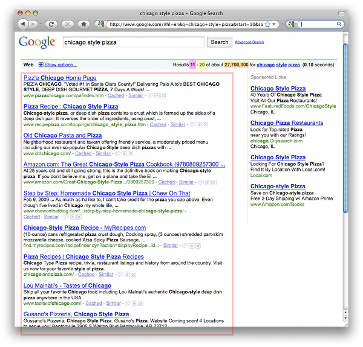
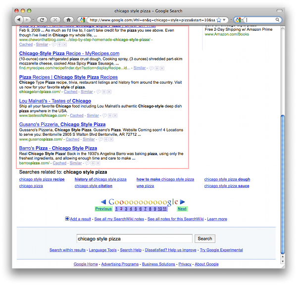

# Google JSON Style Guide

Revision 0.9

## Introduction {#Introduction}

This style guide documents guidelines and recommendations for building JSON APIs
at Google. In general, JSON APIs should follow the spec found at
[JSON.org](https://www.json.org). This style guide clarifies and standardizes
specific cases so that JSON APIs from Google have a standard look and feel.
These guidelines are applicable to JSON requests and responses in both RPC-based
and REST-based APIs.

## Definitions {#Definitions}

For the purposes of this style guide, we define the following terms:

*   **property** - a name/value pair inside a JSON object.
*   **property name** - the name (or key) portion of the property.
*   **property value** - the value portion of the property.

```json
{
  // The name/value pair together is a "property".
  "propertyName": "propertyValue"
}
```

JavaScript's `number` type encompasses all floating-point numbers, which is a
broad designation. In this guide, `number` will refer to JavaScript's `number`
type, while `integer` will refer to integers.

## General Guidelines {#General_Guidelines}

### Comments {#Comments}

No comments in JSON objects.

Comments should not be included in JSON objects. Some of the examples in this
style guide include comments. However this is only to clarify the examples.

```json
{
  // You may see comments in the examples below,
  // But don't include comments in your JSON.
  "propertyName": "propertyValue"
}
```

### Double Quotes {#Double_Quotes}

Use double quotes.

If a property requires quotes, double quotes must be used. All property names
must be surrounded by double quotes. Property values of type string must be
surrounded by double quotes. Other value types (like boolean or number) should
not be surrounded by double quotes.

### Flattened data vs Structured Hierarchy {#Flattened_data_vs_Structured_Hierarchy}

Data should not be arbitrarily grouped for convenience.

Data elements should be "flattened" in the JSON representation. Data should not
be arbitrarily grouped for convenience.

In some cases, such as a collection of properties that represents a single
structure, it may make sense to keep the structured hierarchy. These cases
should be carefully considered, and only used if it makes semantic sense. For
example, an address could be represented two ways, but the structured way
probably makes more sense for developers:

Flattened Address:

```json
{
  "company": "Google",
  "website": "https://www.google.com/",
  "addressLine1": "111 8th Ave",
  "addressLine2": "4th Floor",
  "state": "NY",
  "city": "New York",
  "zip": "10011"
}
```

Structured Address:

```json
{
  "company": "Google",
  "website": "https://www.google.com/",
  "address": {
    "line1": "111 8th Ave",
    "line2": "4th Floor",
    "state": "NY",
    "city": "New York",
    "zip": "10011"
  }
}
```

## Property Name Guidelines {#Property_Name_Guidelines}

### Property Name Format {#Property_Name_Format}

Choose meaningful property names.

Property names must conform to the following guidelines:

*   Property names should be meaningful names with defined semantics.
*   Property names must be camel-cased, ASCII strings.
*   The first character must be a letter, an underscore (`_`) or a dollar sign
    (`$`).
*   Subsequent characters can be a letter, a digit, an underscore, or a dollar
    sign.
*   Reserved JavaScript keywords should be avoided (A list of reserved
    JavaScript keywords can be found below).

These guidelines mirror the guidelines for naming JavaScript identifiers. This
allows JavaScript clients to access properties using dot notation (for example,
`result.thisIsAnInstanceVariable`). Here's an example of an object with one
property:

```json
{
  "thisPropertyIsAnIdentifier": "identifier value"
}
```

### Key Names in JSON Maps {#Key_Names_in_JSON_Maps}

JSON maps can use any Unicode character in key names.

The property name naming rules do not apply when a JSON object is used as a map.
A map (also referred to as an associative array) is a data type with arbitrary
key/value pairs that use the keys to access the corresponding values. JSON
objects and JSON maps look the same at runtime; this distinction is relevant to
the design of the API. The API documentation should indicate when JSON objects
are used as maps.

The keys of a map do not have to obey the naming guidelines for property names.
Map keys may contain any Unicode characters. Clients can access these properties
using the square bracket notation familiar for maps (for example,
`result.thumbnails["72"]`).

```json
{
  // The "address" property is a sub-object
  // holding the parts of an address.
  "address": {
    "addressLine1": "123 Anystreet",
    "city": "Anytown",
    "state": "XX",
    "zip": "00000"
  },
  // The "thumbnails" property is a map that maps
  // a pixel size to the thumbnail url of that size.
  "thumbnails": {
    "72": "https://url.to.72px.thumbnail",
    "144": "https://url.to.144px.thumbnail"
  }
}
```

### Reserved Property Names {#Reserved_Property_Names}

Certain property names are reserved for consistent use across services.

Details about reserved property names, along with the full list, can be found
later on in this guide. Services should avoid using these property names for
anything other than their defined semantics.

### Singular vs Plural Property Names {#Singular_vs_Plural_Property_Names}

Array types should have plural property names. All other property names should
be singular.

Arrays usually contain multiple items, and a plural property name reflects this.
An example of this can be seen in the reserved names below. The `items` property
name is plural because it represents an array of item objects. Most of the other
fields are singular.

There may be exceptions to this, especially when referring to numeric property
values. For example, in the reserved names, `totalItems` makes more sense than
`totalItem`. However, technically, this is not violating the style guide, since
`totalItems` can be viewed as `totalOfItems`, where `total` is singular (as per
the style guide), and `OfItems` serves to qualify the total. The field name
could also be changed to `itemCount` to look singular.

```json
{
  // Singular
  "author": "lisa",
  // An array of siblings, plural
  "siblings": ["bart", "maggie"],
  // "totalItem" doesn't sound right
  "totalItems": 10,
  // But maybe "itemCount" is better
  "itemCount": 10
}
```

### Naming Conflicts {#Naming_Conflicts}

Avoid naming conflicts by choosing a new property name or versioning the API.

New properties may be added to the reserved list in the future. There is no
concept of JSON namespacing. If there is a naming conflict, these can usually be
resolved by choosing a new property name or by versioning. For example, suppose
we start with the following JSON object:

```json
{
  "apiVersion": "1.0",
  "data": {
    "recipeName": "pizza",
    "ingredients": ["tomatoes", "cheese", "sausage"]
  }
}
```

If in the future we wish to make `ingredients` a reserved word, we can do one of
two things:

1\) Choose a different name:

```json
{
  "apiVersion": "1.0",
  "data": {
    "recipeName": "pizza",
    "ingredientsData": "Some new property",
    "ingredients": ["tomatoes", "cheese", "sausage"]
  }
}
```

2\) Rename the property on a major version boundary:

```json
{
  "apiVersion": "2.0",
  "data": {
    "recipeName": "pizza",
    "ingredients": "Some new property",
    "recipeIngredients": ["tomatoes", "cheese", "sausage"]
  }
}
```

## Property Value Guidelines {#Property_Value_Guidelines}

### Property Value Format {#Property_Value_Format}

Property values must be booleans, numbers, Unicode strings, objects, arrays, or
`null`.

The spec at [JSON.org](https://www.json.org) specifies exactly what type of data
is allowed in a property value. This includes booleans, numbers, Unicode
strings, objects, arrays, and `null`. JavaScript expressions are not allowed.
APIs should support that spec for all values, and should choose the data type
most appropriate for a particular property (numbers to represent numbers, etc.).

Good:

```json
{
  "canPigsFly": null,     // null
  "areWeThereYet": false, // boolean
  "answerToLife": 42,     // number
  "name": "Bart",         // string
  "moreData": {},         // object
  "things": []            // array
}
```

Bad:

```json
{
  "aVariableName": aVariableName,         // Bad - JavaScript identifier
  "functionFoo": function() { return 1; } // Bad - JavaScript function
}
```

### Empty/Null Property Values {#Empty_Null_Property_Values}

Consider removing empty or `null` values.

If a property is optional or has an empty or `null` value, consider dropping the
property from the JSON, unless there's a strong semantic reason for its
existence.

```json
{
  "volume": 10,

  // Even though the "balance" property's value is zero, it should be left in,
  // since "0" signifies "even balance" (the value could be "-1" for left
  // balance and "+1" for right balance.
  "balance": 0

  // The "currentlyPlaying" property can be left out since it is null.
  // "currentlyPlaying": null
}
```

### Enum Values {#Enum_Values}

Enum values should be represented as strings.

As APIs grow, enum values may be added, removed or changed. Using strings as
enum values ensures that downstream clients can gracefully handle changes to
enum values.

Java code:

```java
public enum Color {
  WHITE,
  BLACK,
  RED,
  YELLOW,
  BLUE
}
```

JSON object:

```json
{
  "color": "WHITE"
}
```

## Property Value Data Types {#Property_Value_Data_Types}

As mentioned above, property value types must be booleans, numbers, strings,
objects, arrays, or `null`. However, it is useful to define a set of standard
data types when dealing with certain values. These data types will always be
strings, but they will be formatted in a specific manner so that they can be
easily parsed.

### Date Property Values {#Date_Property_Values}

Dates should be formatted as recommended by RFC 3339.

Dates should be strings formatted as recommended by
[RFC 3339](https://www.ietf.org/rfc/rfc3339.txt).

```json
{
  "lastUpdate": "2007-11-06T16:34:41.000Z"
}
```

### Time Duration Property Values {#Time_Duration_Property_Values}

Time durations should be formatted as recommended by ISO 8601.

Time duration values should be strings formatted as recommended by
[ISO 8601](https://en.wikipedia.org/wiki/ISO_8601#Durations).

```json
{
  // three years, six months, four days, twelve hours,
  // thirty minutes, and five seconds
  "duration": "P3Y6M4DT12H30M5S"
}
```

### Latitude/Longitude Property Values {#Latitude_Longitude_Property_Values}

Latitudes/Longitudes should be formatted as recommended by ISO 6709.

Latitude/Longitude should be strings formatted as recommended by
[ISO 6709](https://en.wikipedia.org/wiki/ISO_6709). Furthermore, they should
favor the ±DD.DDDD±DDD.DDDD degrees format.

```json
{
  // The latitude/longitude location of the statue of liberty.
  "statueOfLiberty": "+40.6894-074.0447"
}
```

## JSON Structure & Reserved Property Names {#JSON_Structure_and_Reserved_Property_Names}

In order to maintain a consistent interface across APIs, JSON objects should
follow the structure outlined below. This structure applies to both requests and
responses made with JSON. Within this structure, there are certain property
names that are reserved for specific uses. These properties are NOT required; in
other words, each reserved property may appear zero or one times. But if a
service needs these properties, this naming convention is recommended. Here is a
schema of the JSON structure, represented in [Orderly](http://orderly-json.org/)
format (which in turn can be compiled into a
[JSONSchema](https://json-schema.org/)). You can view a few examples of the JSON
structure at the end of this guide.

```
object {
  string apiVersion?;
  string context?;
  string id?;
  string method?;
  object {
    string id?
  }* params?;
  object {
    string kind?;
    string fields?;
    string etag?;
    string id?;
    string lang?;
    string updated?; # date formatted RFC 3339
    boolean deleted?;
    integer currentItemCount?;
    integer itemsPerPage?;
    integer startIndex?;
    integer totalItems?;
    integer pageIndex?;
    integer totalPages?;
    string pageLinkTemplate /^https?:/ ?;
    object {}* next?;
    string nextLink?;
    object {}* previous?;
    string previousLink?;
    object {}* self?;
    string selfLink?;
    object {}* edit?;
    string editLink?;
    array [
      object {}*;
    ] items?;
  }* data?;
  object {
    integer code?;
    string message?;
    array [
      object {
        string domain?;
        string reason?;
        string message?;
        string location?;
        string locationType?;
        string extendedHelp?;
        string sendReport?;
      }*;
    ] errors?;
  }* error?;
}*;
```

The JSON object has a few top-level properties, followed by either a `data`
object or an `error` object, but not both. An explanation of each of these
properties can be found below.

## Top-Level Reserved Property Names {#Top-Level_Reserved_Property_Names}

The top-level of the JSON object may contain the following properties.

### apiVersion {#apiVersion}

Property Value Type: `string` \
Parent: -

Represents the desired version of the service API in a request, and the version
of the service API that's served in the response. `apiVersion` should always be
present. This is not related to the version of the data. Versioning of data
should be handled through some other mechanism such as etags.

Example:

```json
{ "apiVersion": "2.1" }
```

### context {#context}

Property Value Type: `string` \
Parent: -

Client sets this value and server echoes data in the response. This is useful in
JSON-P and batch situations, where the user can use the `context` to correlate
responses with requests. This property is a top-level property because the
`context` should be present regardless of whether the response was successful or
an error. `context` differs from `id` in that `context` is specified by the user
while `id` is assigned by the service.

Example:

Request #1:

```
https://www.google.com/myapi?context=bart
```

Request #2:

```
https://www.google.com/myapi?context=lisa
```

Response #1:

```json
{
  "context": "bart",
  "data": {
    "items": []
  }
}
```

Response #2:

```json
{
  "context": "lisa",
  "data": {
    "items": []
  }
}
```

Common JavaScript handler code to process both responses:

```js
function handleResponse(response) {
  if (response.result.context == "bart") {
    // Update the "Bart" section of the page.
  } else if (response.result.context == "lisa") {
    // Update the "Lisa" section of the page.
  }
}
```

### id {#id}

Property Value Type: `string` \
Parent: -

A server supplied identifier for the response (regardless of whether the
response is a success or an error). This is useful for correlating server logs
with individual responses received at a client.

Example:

```json
{ "id": "1" }
```

### method {#method}

Property Value Type: `string` \
Parent: -

Represents the operation to perform, or that was performed, on the data. In the
case of a JSON request, the `method` property can be used to indicate which
operation to perform on the data. In the case of a JSON response, the `method`
property can indicate the operation performed on the data.

One example of this is in JSON-RPC requests, where `method` indicates the
operation to perform on the `params` property:

```json
{
  "method": "people.get",
  "params": {
    "userId": "@me",
    "groupId": "@self"
  }
}
```

### params {#params}

Property Value Type: `object` \
Parent: -

This object serves as a map of input parameters to send to an RPC request. It
can be used in conjunction with the `method` property to execute an RPC
function. If an RPC function does not need parameters, this property can be
omitted.

Example:

```json
{
  "method": "people.get",
  "params": {
    "userId": "@me",
    "groupId": "@self"
  }
}
```

### data {#data}

Property Value Type: `object` \
Parent: -

Container for all the data from a response. This property itself has many
reserved property names, which are described below. Services are free to add
their own data to this object. A JSON response should contain either a `data`
object or an `error` object, but not both. If both `data` and `error` are
present, the `error` object takes precedence.

### error {#error}

Property Value Type: `object` \
Parent: -

Indicates that an error has occurred, with details about the error. The error
format supports either one or more errors returned from the service. A JSON
response should contain either a `data` object or an `error` object, but not
both. If both `data` and `error` are present, the `error` object takes
precedence.

Example:

```json
{
  "apiVersion": "2.0",
  "error": {
    "code": 404,
    "message": "File Not Found",
    "errors": [{
      "domain": "Calendar",
      "reason": "ResourceNotFoundException",
      "message": "File Not Found"
    }]
  }
}
```

## Reserved Property Names in the data object {#Reserved_Property_Names_in_the_data_object}

The `data` property of the JSON object may contain the following properties.

### data.kind {#data.kind}

Property Value Type: `string` \
Parent: `data`

The `kind` property serves as a guide to what type of information this
particular object stores. It can be present at the `data` level, or at the
`items` level, or in any object where it's helpful to distinguish between
various types of objects. If the `kind` object is present, it should be the
first property in the object (See the [Property Ordering](#Property_Ordering)
section below for more details).

Example:

```json
// "Kind" indicates an "album" in the Picasa API.
{"data": {"kind": "album"}}
```

### data.fields {#data.fields}

Property Value Type: `string` \
Parent: `data`

Represents the fields present in the response when doing a partial GET, or the
fields present in a request when doing a partial PATCH. This property should
only exist during a partial GET/PATCH, and should not be empty.

Example:

```json
{
  "data": {
    "kind": "user",
    "fields": "author,id",
    "id": "bart",
    "author": "Bart"
  }
}
```

### data.etag {#data.etag}

Property Value Type: `string` \
Parent: `data`

Represents the etag for the response. Details about ETags in the GData APIs can
be found here:
https://code.google.com/apis/gdata/docs/2.0/reference.html#ResourceVersioning

Example:

```json
{"data": {"etag": "W/\"C0QBRXcycSp7ImA9WxRVFUk.\""}}
```

### data.id {#data.id}

Property Value Type: `string` \
Parent: `data`

A globally unique string used to reference the object. The specific details of
the `id` property are left up to the service.

Example:

```json
{"data": {"id": "12345"}}
```

### data.lang {#data.lang}

Property Value Type: `string` (formatted as specified in BCP 47) \
Parent: `data` (or any child element)

Indicates the language of the rest of the properties in this object. This
property mimics HTML's `lang` property and XML's `xml:lang` properties. The
value should be a language value as defined in
[BCP 47](https://www.rfc-editor.org/rfc/bcp/bcp47.txt). If a single JSON object
contains data in multiple languages, the service is responsible for developing
and documenting an appropriate location for the `lang` property.

Example:

```json
{"data": {
  "items": [
    { "lang": "en",
      "title": "Hello world!" },
    { "lang": "fr",
      "title": "Bonjour monde!" }
  ]}
}
```

### data.updated {#data.updated}

Property Value Type: `string` (formatted as specified in RFC 3339) \
Parent: `data`

Indicates the last date/time ([RFC 3339](https://www.ietf.org/rfc/rfc3339.txt))
the item was updated, as defined by the service.

Example:

```json
{"data": {"updated": "2007-11-06T16:34:41.000Z"}}
```

### data.deleted {#data.deleted}

Property Value Type: `boolean` \
Parent: `data` (or any child element)

A marker element, that, when present, indicates the containing entry is deleted.
If `deleted` is present, its value must be `true`; a value of `false` can cause
confusion and should be avoided.

Example:

```json
{"data": {
  "items": [
    { "title": "A deleted entry",
      "deleted": true
    }
  ]}
}
```

### data.items {#data.items}

Property Value Type: `array` \
Parent: `data`

The property name `items` is reserved to represent an array of items (for
example, photos in Picasa, videos in YouTube). This construct is intended to
provide a standard location for collections related to the current result. For
example, the JSON output could be plugged into a generic pagination system that
knows to page on the `items` array. If `items` exists, it should be the last
property in the `data` object (See the [Property Ordering](#Property_Ordering)
section below for more details).

Example:

```json
{
  "data": {
    "items": [
      { /* Object #1 */ },
      { /* Object #2 */ },
      ...
    ]
  }
}
```

## Reserved Property Names for Paging {#Reserved_Property_Names_for_Paging}

The following properties are located in the `data` object, and help page through
a list of items. Some of the language and concepts are borrowed from the
[OpenSearch specification](https://www.opensearch.org/).

The paging properties below allow for various styles of paging, including:

*   Previous/Next paging - Allows users to move forward and backward through a
    list, one page at a time. The `nextLink` and `previousLink` properties
    (described in the
    [Reserved Property Names for Links](#Reserved_Property_Names_for_Links)
    section below) are used for this style of paging.
*   Index-based paging - Allows users to jump directly to a specific item
    position within a list of items. For example, to load 10 items starting at
    item 200, the developer may point the user to a URL with the query string
    `?startIndex=200`.
*   Page-based paging - Allows users to jump directly to a specific page within
    the items. This is similar to index-based paging, but saves the developer
    the extra step of having to calculate the item index for a new page of
    items. For example, rather than jump to item number 200, the developer could
    jump to page 20. The URLs during page-based paging could use the query
    string `?page=1` or `?page=20`. The `pageIndex` and `totalPages` properties
    are used for this style of paging.

An example of how to use these properties to implement paging can be found at
the end of this guide.

### data.currentItemCount {#data.currentItemCount}

Property Value Type: `integer` \
Parent: `data`

The number of items in this result set. Should be equivalent to `items.length`,
and is provided as a convenience property. For example, suppose a developer
requests a set of search items, and asks for 10 items per page. The total set of
that search has 14 total items. The first page of items will have 10 items in
it, so both `itemsPerPage` and `currentItemCount` will equal `10`. The next page
of items will have the remaining 4 items; `itemsPerPage` will still be `10`, but
`currentItemCount` will be `4`.

Example:

```json
{
  "data": {
    // "itemsPerPage" does not necessarily match "currentItemCount"
    "itemsPerPage": 10,
    "currentItemCount": 4
  }
}
```

### data.itemsPerPage {#data.itemsPerPage}

Property Value Type: `integer` \
Parent: `data`

The number of items in the result. This is not necessarily the size of the
`data.items` array; if we are viewing the last page of items, the size of
`data.items` may be less than `itemsPerPage`. However the size of `data.items`
should not exceed `itemsPerPage`.

Example:

```json
{
  "data": {
    "itemsPerPage": 10
  }
}
```

### data.startIndex {#data.startIndex}

Property Value Type: `integer` \
Parent: `data`

The index of the first item in `data.items`. For consistency, `startIndex`
should be 1-based. For example, the first item in the first set of items should
have a `startIndex` of 1. If the user requests the next set of data, the
`startIndex` may be 10.

Example:

```json
{
  "data": {
    "startIndex": 1
  }
}
```

### data.totalItems {#data.totalItems}

Property Value Type: `integer` \
Parent: `data`

The total number of items available in this set. For example, if a user has 100
blog posts, the response may only contain 10 items, but the `totalItems` would
be 100.

Example:

```json
{
  "data": {
    "totalItems": 100
  }
}
```

### data.pagingLinkTemplate {#data.pagingLinkTemplate}

Property Value Type: `string` \
Parent: `data`

A URI template indicating how users can calculate subsequent paging links. The
URI template also has some reserved variable names: `{index}` representing the
item number to load, and `{pageIndex}`, representing the page number to load.

Example:

```json
{
  "data": {
    "pagingLinkTemplate": "https://www.google.com/search/hl=en&q=chicago+style+pizza&start={index}&sa=N"
  }
}
```

### data.pageIndex {#data.pageIndex}

Property Value Type: `integer` \
Parent: `data`

The index of the current page of items. For consistency, `pageIndex` should be
1-based. For example, the first page of items has a `pageIndex` of 1.
`pageIndex` can also be calculated from the item-based paging properties:
`pageIndex = floor(startIndex / itemsPerPage) + 1`.

Example:

```json
{
  "data": {
    "pageIndex": 1
  }
}
```

### data.totalPages {#data.totalPages}

Property Value Type: `integer` \
Parent: `data`

The total number of pages in the result set. `totalPages` can also be calculated
from the item-based paging properties above: `totalPages = ceiling(totalItems /
itemsPerPage)`.

Example:

```json
{
  "data": {
    "totalPages": 50
  }
}
```

## Reserved Property Names for Links {#Reserved_Property_Names_for_Links}

The following properties are located in the `data` object, and represent
references to other resources. There are two forms of link properties:

1.  objects, which can contain any sort of reference (such as a JSON-RPC
    object), and
2.  URI strings, which represent URIs to resources (and will always be suffixed
    with `Link`).

### data.self / data.selfLink {#data.self}

Property Value Type: `object` / `string` \
Parent: `data`

The self link can be used to retrieve the item's data. For example, in a list of
a user's Picasa album, each album object in the `items` array could contain a
`selfLink` that can be used to retrieve data related to that particular album.

Example:

```json
{
  "data": {
    "self": {},
    "selfLink": "https://www.google.com/feeds/album/1234"
  }
}
```

### data.edit / data.editLink {#data.edit}

Property Value Type: `object` / `string` \
Parent: `data`

The edit link indicates where a user can send update or delete requests. This is
useful for REST-based APIs. This link need only be present if the user can
update/delete this item.

Example:

```json
{
  "data": {
    "edit": {},
    "editLink": "https://www.google.com/feeds/album/1234/edit"
  }
}
```

### data.next / data.nextLink {#data.next}

Property Value Type: `object` / `string` \
Parent: `data`

The next link indicates how more data can be retrieved. It points to the
location to load the next set of data. It can be used in conjunction with the
`itemsPerPage`, `startIndex` and `totalItems` properties in order to page
through data.

Example:

```json
{
  "data": {
    "next": {},
    "nextLink": "https://www.google.com/feeds/album/1234/next"
  }
}
```

### data.previous / data.previousLink {#data.previous}

Property Value Type: `object` / `string` \
Parent: `data`

The previous link indicates how more data can be retrieved. It points to the
location to load the previous set of data. It can be used in conjunction with
the `itemsPerPage`, `startIndex` and `totalItems` properties in order to page
through data.

Example:

```json
{
  "data": {
    "previous": {},
    "previousLink": "https://www.google.com/feeds/album/1234/next"
  }
}
```

## Reserved Property Names in the error object {#Reserved_Property_Names_in_the_error_object}

The `error` property of the JSON object may contain the following properties.

### error.code {#error.code}

Property Value Type: `integer` \
Parent: `error`

Represents the code for this error. This property value will usually represent
the HTTP response code. If there are multiple errors, `code` will be the error
code for the first error.

Example:

```json
{
  "error": {
    "code": 404
  }
}
```

### error.message {#error.message}

Property Value Type: `string` \
Parent: `error`

A human readable message providing more details about the error. If there are
multiple errors, `message` will be the message for the first error.

Example:

```json
{
  "error": {
    "message": "File Not Found"
  }
}
```

### error.errors {#error.errors}

Property Value Type: `array` \
Parent: `error`

Container for any additional information regarding the error. If the service
returns multiple errors, each element in the `errors` array represents a
different error.

Example:

```json
{ "error": { "errors": [] } }
```

### error.errors[].domain {#error.errors.domain}

Property Value Type: `string` \
Parent: `error.errors`

Unique identifier for the service raising this error. This helps distinguish
service-specific errors (i.e. error inserting an event in a calendar) from
general protocol errors (i.e. file not found).

Example:

```json
{
  "error": {
    "errors": [{"domain": "Calendar"}]
  }
}
```

### error.errors[].reason {#error.errors.reason}

Property Value Type: `string` \
Parent: `error.errors`

Unique identifier for this error. Different from the `error.code` property in
that this is not an HTTP response code.

Example:

```json
{
  "error": {
    "errors": [{"reason": "ResourceNotFoundException"}]
  }
}
```

### error.errors[].message {#error.errors.message}

Property Value Type: `string` \
Parent: `error.errors`

A human readable message providing more details about the error. If there is
only one error, this field will match `error.message`.

Example:

```json
{
  "error": {
    "code": 404,
    "message": "File Not Found",
    "errors": [{"message": "File Not Found"}]
  }
}
```

### error.errors[].location {#error.errors.location}

Property Value Type: `string` \
Parent: `error.errors`

The location of the error (the interpretation of its value depends on
`locationType`).

Example:

```json
{
  "error": {
    "errors": [{"location": ""}]
  }
}
```

### error.errors[].locationType {#error.errors.locationType}

Property Value Type: `string` \
Parent: `error.errors`

Indicates how the `location` property should be interpreted.

Example:

```json
{
  "error": {
    "errors": [{"locationType": ""}]
  }
}
```

### error.errors[].extendedHelp {#error.errors.extendedHelp}

Property Value Type: `string` \
Parent: `error.errors`

A URI for a help text that might shed some more light on the error.

Example:

```json
{
  "error": {
    "errors": [{"extendedHelper": "https://url.to.more.details.example.com/"}]
  }
}
```

### error.errors[].sendReport {#error.errors.sendReport}

Property Value Type: `string` \
Parent: `error.errors`

A URI for a report form used by the service to collect data about the error
condition. This URI should be preloaded with parameters describing the request.

Example:

```json
{
  "error": {
    "errors": [{"sendReport": "https://report.example.com/"}]
  }
}
```

## Property Ordering {#Property_Ordering}

Properties can be in any order within the JSON object. However, in some cases
the ordering of properties can help parsers quickly interpret data and lead to
better performance. One example is a pull parser in a mobile environment, where
performance and memory are critical, and unnecessary parsing should be avoided.

### Kind Property {#Kind_Property}

`kind` should be the first property.

Suppose a parser is responsible for parsing a raw JSON stream into a specific
object. The `kind` property guides the parser to instantiate the appropriate
object. Therefore it should be the first property in the JSON object. This only
applies when objects have a `kind` property (usually found in the `data` and
`items` properties).

### Items Property {#Items_Property}

`items` should be the last property in the `data` object.

This allows all of the collection's properties to be read before reading each
individual item. In cases where there are a lot of items, this avoids
unnecessarily parsing those items when the developer only needs fields from the
data.

### Property Ordering Example {#Property_Ordering_Example}

```json
// The "kind" property distinguishes between an "album" and a "photo".
// "Kind" is always the first property in its parent object.
// The "items" property is the last property in the "data" object.
{
  "data": {
    "kind": "album",
    "title": "My Photo Album",
    "description": "An album in the user's account",
    "items": [
      {
        "kind": "photo",
        "title": "My First Photo"
      }
    ]
  }
}
```

## Examples {#Examples}

### YouTube JSON API {#YouTube_JSON_API}

Here's an example of the YouTube JSON API's response object. You can learn more
about YouTube's JSON API here:
https://code.google.com/apis/youtube/2.0/developers_guide_jsonc.html.

```json
{
  "apiVersion": "2.0",
  "data": {
    "updated": "2010-02-04T19:29:54.001Z",
    "totalItems": 6741,
    "startIndex": 1,
    "itemsPerPage": 1,
    "items": [
      {
        "id": "BGODurRfVv4",
        "uploaded": "2009-11-17T20:10:06.000Z",
        "updated": "2010-02-04T06:25:57.000Z",
        "uploader": "docchat",
        "category": "Animals",
        "title": "From service dog to SURFice dog",
        "description": "Surf dog Ricochets inspirational video ...",
        "tags": [
          "Surf dog",
          "dog surfing",
          "dog",
          "golden retriever"
        ],
        "thumbnail": {
          "default": "https://i.ytimg.com/vi/BGODurRfVv4/default.jpg",
          "hqDefault": "https://i.ytimg.com/vi/BGODurRfVv4/hqdefault.jpg"
        },
        "player": {
          "default": "https://www.youtube.com/watch?v=BGODurRfVv4&feature=youtube_gdata",
          "mobile": "https://m.youtube.com/details?v=BGODurRfVv4"
        },
        "content": {
          "1": "rtsp://v5.cache6.c.youtube.com/CiILENy73wIaGQn-Vl-0uoNjBBMYDSANFEgGUgZ2aWRlb3MM/0/0/0/video.3gp",
          "5": "https://www.youtube.com/v/BGODurRfVv4?f=videos&app=youtube_gdata",
          "6": "rtsp://v7.cache7.c.youtube.com/CiILENy73wIaGQn-Vl-0uoNjBBMYESARFEgGUgZ2aWRlb3MM/0/0/0/video.3gp"
        },
        "duration": 315,
        "rating": 4.96,
        "ratingCount": 2043,
        "viewCount": 1781691,
        "favoriteCount": 3363,
        "commentCount": 1007,
        "commentsAllowed": true
      }
    ]
  }
}
```

### Paging Example {#Paging_Example}

This example demonstrates how the Google search items could be represented as a
JSON object, with special attention to the paging variables.

This sample is for illustrative purposes only. The API below does not actually
exist.

Here's a sample Google search results page:





Here's a sample JSON representation of this page:

```json
{
  "apiVersion": "2.1",
  "id": "1",
  "data": {
    "query": "chicago style pizza",
    "time": "0.1",
    "currentItemCount": 10,
    "itemsPerPage": 10,
    "startIndex": 11,
    "totalItems": 2700000,
    "nextLink": "https://www.google.com/search?hl=en&q=chicago+style+pizza&start=20&sa=N",
    "previousLink": "https://www.google.com/search?hl=en&q=chicago+style+pizza&start=0&sa=N",
    "pagingLinkTemplate": "https://www.google.com/search/hl=en&q=chicago+style+pizza&start={index}&sa=N",
    "items": [
      {
        "title": "Pizz'a Chicago Home Page"
        // More fields for the search results
      }
      // More search results
    ]
  }
}
```

Here's how each of the colored boxes from the screenshot would be represented
(the background colors correspond to the colors in the images above):

*   Results <span style="background-color:rgb(180, 167, 214)">11</span> - 20 of
    about 2,700,000 = `startIndex`
*   Results 11 - <span style="background-color:rgb(255, 217, 102)">20</span> of
    about 2,700,000 = `startIndex + currentItemCount - 1`
*   Results 11 - 20 of about
    <span style="background-color:rgb(246, 178, 107)">2,700,000</span> =
    `totalItems`
*   <span style="background-color:rgb(234, 153, 153)">Search results</span> =
    `items` (formatted appropriately)
*   <span style="background-color:rgb(182, 215, 168)">Previous/Next</span> =
    `previousLink` / `nextLink`
*   <span style="background-color:rgb(159, 197, 232)">Numbered links in
    "Gooooooooooogle"</span> = Derived from `pageLinkTemplate`. The developer is
    responsible for calculating the values for `{index}` and substituting those
    values into the `pageLinkTemplate`. The `pageLinkTemplate`'s `{index}`
    variable is calculated as follows:
    *   Index #1 = `0 * itemsPerPage = 0`
    *   Index #2 = `2 * itemsPerPage = 10`
    *   Index #3 = `3 * itemsPerPage = 20`
    *   Index #N = `N * itemsPerPage`

## Appendix {#Appendix}

### Appendix A: Reserved JavaScript Words {#Appendix_A}

A list of reserved JavaScript words that should be avoided in property names.

The words below are reserved by the JavaScript language and cannot be referred
to using dot notation. The list represents best knowledge of keywords at this
time; the list may change or vary based on your specific execution environment.

From the
[ECMAScript Language Specification 5th Edition](https://www.ecma-international.org/publications-and-standards/standards/ecma-262/):

```
abstract
boolean break byte
case catch char class const continue
debugger default delete do double
else enum export extends
false final finally float for function
goto
if implements import in instanceof int interface
let long
native new null
package private protected public
return
short static super switch synchronized
this throw throws transient true try typeof
var volatile void
while with
yield
```
